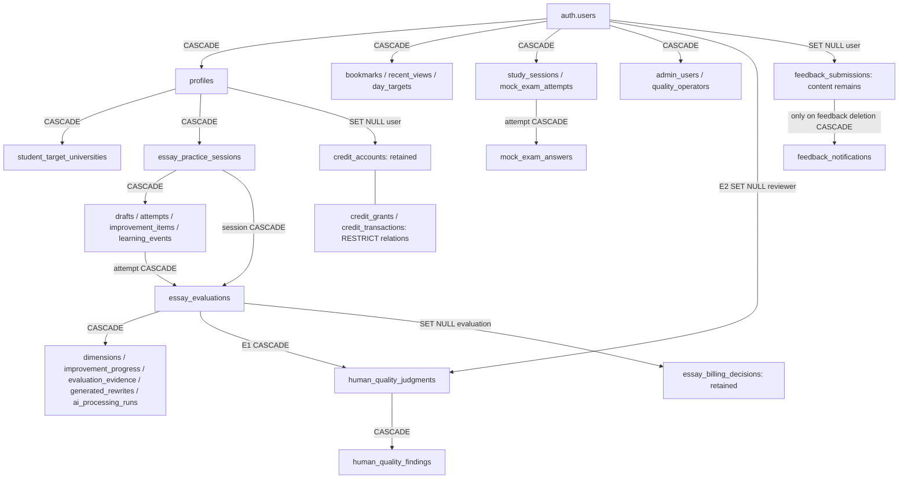

# ADR-1 — 14-day account deletion lifecycle

Successor: [ADR-2 local implementation](account-deletion-14-day-implementation.md), Production NOT_APPLIED. Earlier status below is historical.

Date: 2026-10-01. Status: DESIGN REVIEW; NOT IMPLEMENTED / NOT APPLIED.
Scope: canonical APP/shared-backend account lifecycle only. LAB/HQR-1 and Unified
Wiki are concurrent work and were not modified. No DB connection, credentials,
Production query/write, migration, provider call or deployment in this review.

Successor: [ADR-1B](account-deletion-erasure-retention-boundary.md) records later accepted Owner A/B/C/D and YES_WITH_EXTERNAL_GATES readiness. Earlier unresolved items/readiness below are historical; ADR-1 was not retroactively rewritten.

## Policy and evidence boundary

Owner policy is final: deletion request → immediate DELETION_PENDING → 14-day
**deletion grace period** → automatic personal-data erasure. Pending operational
data is not analytics data. No administrator may extend the deadline, cancel the
request for the user, or create an indefinite retention hold. The mechanisms below
are ADR-1 recommendations, not deployed capabilities or new Owner acceptances.

Reviewed canonical branch `codex/essay-scaffolding-vnext`, starting source commit
`cbd80c90f5b104dc50e9d1a961f73d48849ce52e`. Production statements below use existing
closeouts/Owner reports; this task does not independently reverify live catalogs.

| Evidence | Verified code/record meaning |
|---|---|
| [Privacy foundation](account-deletion-privacy.md), [handler](../supabase/functions/delete-account/handler.ts), [entrypoint](../supabase/functions/delete-account/index.ts) | Feature-gated immediate Auth Admin delete candidate; no request/deadline/cancellation/cron. Last recorded deployment pending, not a fresh runtime observation. Handler verifies caller token, ignores caller-supplied target, blocks admin_users. |
| [Flutter service](../lib/features/auth/account_deletion.dart) | Calls delete-account, expects completed deletion, local sign-out afterward; recent-auth requirement false. Cannot serve as a 14-day receipt/status contract unchanged. |
| [Avatar cleanup](../supabase/functions/delete-account/avatar-cleanup.ts) | Storage API removes exact owner/avatar.png before Auth deletion when server photo flag enabled; failure aborts candidate. Not a general storage inventory or DB cascade. |
| [Essay product migration](../supabase/migrations/20260928000100_student_essay_product.sql), [operations](../supabase/migrations/20260928000300_essay_server_operations.sql) | Personal session/attempt/evaluation cascade and owner-only essay_erase; latter releases authorized/reserved decisions before deleting a session. Auth FK cascade does not invoke that RPC. |
| [Entitlements](../supabase/migrations/20260928000200_essay_entitlements.sql), [commercial core](../supabase/migrations/20260929000300_essay_credit_commercial_core.sql) | Ledger survives profile/evaluation deletion by nulling links. Signup reference embeds Auth UUID; manual grant actor embeds operator UUID. FK detachment is insufficient erasure. |
| [HQP migration](../supabase/migrations/20261001000200_human_quality_persistence.sql), [HQP closeout](human-quality-persistence-implementation.md) | Evaluation→judgment→finding CASCADE; reviewer→judgment SET NULL. E1/E2 isolated checks recorded, Owner applied/tracked HQP; no new deletion test here. |
| [Feedback](../supabase/migrations/20260917000100_feedback_operations.sql) | Auth→feedback SET NULL; feedback body/outbox can remain. “ANONYMIZE” in historical inventory is not a guarantee. |

**Current state: PARTIAL FOUNDATION / IMMEDIATE-DELETE CANDIDATE;
14-DAY LIFECYCLE NOT IMPLEMENTED.** Do not enable/deploy the old handler as the new
policy. Historical “no migration required” and “all rows cascade” statements apply
to the earlier limited inventory, not the current architecture.

## Minimum new canonical fact and state model

A server-owned account deletion request is required, separate from profiles and
analytics. Proposed one narrow lifecycle relation, exact SQL/name deferred to
implementation review; no generic workflow/RBAC/event warehouse.

Minimum facts: request ID, active Auth subject, server requested_at, immutable
scheduled_deletion_at, state, cancelled_at/completed_at, bounded phase checkpoint,
lease/fencing token and expiry, retry_count/next_attempt_at, sanitized error code,
notification delivery status. Do not store email/name, answer, output/hash,
credentials, arbitrary error body or a copied profile. A provider credential, if
needed for revocation, belongs in an explicitly approved short-lived secret store,
not this relation.

- `scheduled_deletion_at = requested_at + 336 hours`, UTC timestamptz; UI displays
  local time. Deadline is not calendar midnight, cron execution time or last retry.
- One active request per subject. Exact repeated request returns the existing ID
  and original deadline. New user request after genuine cancellation is a new fact.
- States: DELETION_PENDING → ERASING → ERASED; DELETION_PENDING → CANCELLED.
  Retriable failure is phase/retry metadata, never a permanently abandoned terminal
  FAILED state. No ADMIN_HOLD or mutable retention deadline.
- Keep original request/cancellation times; worker attempts cannot overwrite the
  user's intent. Fixed milestones and current retry metadata suffice at launch.
- Lifecycle row must survive the Auth deletion call until its postcondition is
  reconciled; a cascading Auth FK would lose the job prematurely. Subject linkage
  becomes NULL only at verified Auth deletion. Any encrypted residual object/token
  locator is still personal cleanup data, not anonymized analytics.
- Terminal receipt cleanup and cancelled-request retention need an explicit finite
  schedule before implementation. No permanent UUID/hash tombstone by default.
  Worker deduplication after completion must not require retaining personal content.

## Access and cancellation decisions

Recommended: authentication may establish a **restricted deletion-management
session**, but ordinary personalized services are denied from the request's commit.
Only request status and explicit cancellation before the deadline remain available;
public guest materials stay public. Logging in never cancels deletion automatically.
A blanket provider-login ban alone prevents authenticated withdrawal and is not the
proposed mechanism.

Cancellation requires the same canonical subject plus server-verified recent
reauthentication; no supplied user ID, email-domain test or admin override. Under a
row lock it succeeds only while state=DELETION_PENDING AND now < deadline. At or
after the deadline it fails even if cron is late. Worker claim and cancellation
share that lock; once ERASING, no reversal/reconstruction. At equality, erasure wins.
Cancelled users must reestablish a normal session; no automatic AI job restart.

Revoke existing refresh sessions after the request is durable; access-token validity
alone must not authorize service use. Every relevant server path must consult the
lifecycle: personal owner RLS, definer RPCs, storage policies, credit provisioning,
Essay submit/request/claim/finalize, Quality operator read/write access, and profile
creation/update. UI redirects are insufficient. A pending operator remains pending
regardless of allowlist membership. Existing shared identity must not be forked into
a deletion user system. APP/LAB consumers will need the shared restricted-session
contract in a separate implementation; no LAB changes are made in ADR-1.

Do not let the existing `admin_blocked` branch become indefinite retention. Operator
access stops immediately; account removal still reaches the fixed deadline. Any
operational handover is completed within that window and cannot veto deletion.

## Essay and in-flight processing

At request commit, deny new submissions/evaluation/rewrite requests, credit grants
for new usage and worker dispatch/claim. Cancel queued, unstarted work with existing
billing-release semantics. Already outbound AI may not be recallable: prohibit new
student-result publication and retain only necessary internal reconciliation until
hard erasure. No automatic provider retry, replacement generation or refund inference.
Production AI is currently OFF; the race must nevertheless be designed before it is
activated.

All participating create/claim/finalize/erase paths need a shared lifecycle lock or
fencing rule. Acquire lifecycle lock before existing credit-account/session/grant
locks consistently; implementation must test deadlocks and finalize-after-erasure.
RLS checks alone do not fence service workers. Once ERASING no path may recreate a
profile, attempt, result, QA judgment or owned storage object. Quality readers should
exclude pending students' operational answers; cancellation restores eligibility.

`essay_erase(p_session)` is caller-owned, not a cross-user scheduler API. A future
narrow internal erasure routine must reuse its release/lock invariants without
impersonating a student JWT or exposing arbitrary-user deletion to clients. Release
remaining authorized/reserved credits exactly once before removing evaluations.
Settled consumption is not an automatic refund. Unknown provider completion does
not justify preserving the student's answer indefinitely; unresolved financial
reconciliation uses only a separately approved minimum retained record.

## Hard-delete graph — current canonical SQL

Arrows describe FK effects, not an application execution order. Public content,
question/evidence/university masters are not personal erasure targets.

Supporting personal FKs: [initial](../supabase/migrations/20260912000100_initial_content_schema.sql),
[study](../supabase/migrations/20260914000100_study_sessions.sql),
[mock](../supabase/migrations/20260914000200_mock_exam_scoring.sql),
[D-Day](../supabase/migrations/20260926000100_day_targets.sql),
[Quality membership](../supabase/migrations/20261001000100_quality_read_authorization.sql).
Mock study-session reference and Essay previous-progress/superseded-evaluation links
use SET NULL for their predecessor references; this does not preserve a deleted
student's subject rows. Session/evaluation child FKs still erase those rows.

E1: hard-erased student evaluation removes QA hashes, notes, correction chains and
findings. Invalidation, supersession and reevaluation do not hard-delete that subject.
E2: deleting a reviewer preserves reviews of **other retained student evaluations**,
with reviewer_user_id NULL and deleted-reviewer presentation. If the same account is
both student and reviewer, E1 removes reviews of its own erased evaluations; E2
preserves its reviews of other surviving evaluations. No reviewer identity snapshot.

Auth-owned internal identities/sessions are managed through Auth Admin API, not
manual auth-schema SQL. Storage objects, client caches, emailed notifications,
provider tokens and backups are not covered by these public FKs. No claim that
this graph inventories vendor-internal schemas or already proves total erasure.

## Erasure execution and reconciliation

Recommended scheduler: a server-only scheduled dispatcher every five minutes,
calling a narrow worker with protected server credentials. No browser service key,
no SQL DELETE of storage metadata. Deployment platform/cron configuration must be
verified at implementation; do not claim a scheduler already exists. Deadline is
eligibility for immediate automatic erasure; dispatch latency is operational delay,
not extra grace or permission to retain indefinitely.

1. Claim due request atomically with short lease and fencing token; fixed deadline
   remains unchanged. Recover expired leases. New processing/access already blocked.
2. Reconcile/release reserved billing entries, then erase all personal Essay sessions
   in bounded, idempotent transactions. HQP E1 cascades in the same DB transaction.
   Commit phase progress only with the corresponding transaction.
3. Remove personal feedback bodies and dependent outbox metadata under the final retention plan,
   private storage via Storage API and provider grants via supported revocation.
   Stop stale uploads. Enumerate actual owned-object scope, not just the current
   avatar filename. Preserve only a minimal bounded cleanup locator while retrying.
4. Finish personal domain cleanup; Auth Admin hard deletion **last** triggers Profile
   and remaining personal FK cascades plus E2. Do not pre-delete profiles without
   planning downstream credit detachment. Auth already absent is reconciled success
   only after confirming other erasure postconditions; a timeout is unknown.
5. Verify subject rows, storage and cleanup obligations absent/completed; mark ERASED,
   clear personal job identifiers and apply the finite receipt-expiry policy. Auth
   absence alone is not full-erasure success. Never claim successful completion for
   unresolved external cleanup.

DB and Auth/Storage APIs are not one distributed transaction. After partial erasure,
keep ERASING, access denied, resume from verified postconditions. Retries use request
ID+phase as idempotency keys; missing objects are safe only after precise checks.
Backoff is bounded (proposal: cap at 30 minutes); no retry-count cutoff that silently
abandons the request. A separate watchdog checks overdue pending jobs, expired
leases, stuck phases and scheduler heartbeat; alerts Owner and requeues work.
Recovery after outage drains every overdue request using the original deadline.
Notifications failing never prevent erasure. Manual action may retry/escalate an
incident, never cancel/extend the user's deadline.

Storage/provider outages cannot be made impossible by architecture. A measured
incident remains non-compliance with the target timing, not a new retention policy.
Before launch, approve finite residual-cleanup retention and an escalation runbook;
if external cleanup fails, independent local-data erasure must continue rather than
holding all student content hostage. Keep only the necessary cleanup locator under
that bounded exception, and do not mark total erasure complete. This exception's
exact retention limit is an unresolved implementation gate, not indefinite admin discretion.

## Credit/Billing and other retention boundaries

| Category | Current behavior | Required direction before implementation |
|---|---|---|
| Answer, evaluation, progress, QA, personal profile/learning | Personal cascade graph | Erase at deadline; no analytics copy, UUID/hash archive or copy-before-delete |
| Credit balance/grants/transactions/decisions | Immutable ledger survives; profile/evaluation links null | Preserve transaction integrity and necessary accounting facts; document finite purpose/category-based retention and access. No invented statutory period or assumption every free grant is legally retained |
| Signup grant external_reference and transaction idempotency_key | `signup_bonus/<auth UUID>` and `grant/signup_bonus/<auth UUID>` | Confirmed residual student identifier despite FK nulling. Narrow privacy-detachment/opaque-key design and immutable-ledger exception need review; cannot call current result de-identified |
| Manual grant actor_reference | `operator/<auth UUID>` | Retained reviewer/operator identity outside HQP E2. Decide necessary audit basis/finite retention versus privacy-safe replacement; E2 alone does not fix credit records |
| Billing idempotency keys / external payment references | Opaque but linkable transaction identifiers | Inventory correlation, restrict finance access, remove unnecessary personal linkage. Do not delete amounts/reversal chains or silently anonymize by dropping one FK |
| Feedback body / notification metadata | Feedback survives Auth SET NULL; body may include personal text; outbox references it | Default personal-content deletion, not “anonymous feedback.” Correlation must be captured securely before nulling; classify any exceptional retained record explicitly |
| Client study files/cache/outbox | Local post-delete cleanup path; offline device not server-controlled | Clear accessible personal cache on request, prevent pending outbox replay, durable retry cleanup on next connection; no promise of remote erasure of offline copies |
| Provider copies/email/managed backup | Not proven by FK graph | Inventory destinations and actual retention/deletion/restore constraints before launch; restore must reapply outstanding erasures before reopening service |

Existing append-only ledger guards mean privacy detachment is not safely solved by
an ad hoc UPDATE. This is a bounded follow-up design within account deletion, not
permission to implement ledger cleanup now. Accounting policy and actual provider
contracts must determine legal/operational retention; this audit establishes no new
legal obligation. Financial preservation must not become indefinite personal-data
retention or an analytics archive.

## Administrator notification

Required operational notification: request received and overdue/failed-phase alerts.
Use the deletion request's bounded delivery/retry fields with a server-only sender;
reuse an established delivery transport only after review. Do not reuse the
feedback-specific notification table as generic deletion authority. Alert payload:
request reference/deadline/error category, no answer or account contact details.
An authenticated operational lookup is separately authorized; Quality membership or
feedback admin status does not automatically grant global deletion control.
Admin acknowledgment is not required to start the clock or permit the worker.
No new email/webhook/notification implementation in ADR-1.

## Launch gates and follow-up

**LAUNCH_REQUIRED for this deletion lifecycle:**

- Approve restricted login/cancellation contract and finite request/cleanup receipt
  retention; no reopening of Owner's fixed 14-day policy.
- Resolve residual credit UUID/actor linkage with precise accounting retention and
  privacy-erasure exception; identify feedback/outbox scrubbing scope.
- Implement request/cancel/status authority, all service/worker gates, fixed deadline,
  protected scheduled worker, watchdog, finite cleanup and alerts.
- Resolve current Apple revoke gap and verify provider/Storage/backup behavior and
  recovery. No “all data erased” claim from Auth deletion alone.
- Validate overdue incidents and backup restore erasure controls; existing candidate's
  administrator block cannot prevent erasure indefinitely.
- Isolated tests first: 336-hour boundary, concurrent cancel/claim, duplicate request,
  expired lease, old JWT, operator bypass, queued/in-flight finalize, grant/profile
  recreation, billing release once, HQP E1/E2 overlap, feedback/body/key removal,
  Auth timeout-after-success, storage failure, notification failure and outage catch-up.
  Production verification/application requires separate authorization.

**POST_LAUNCH / separate gate:** PRIVACY_ANALYTICS_RETENTION_DESIGN and any reviewed
pseudonymization/de-identification pipeline; aggregate analytics, advanced operational
reporting. Baseline erasure, failure alerts and service restrictions are not deferred.

**READY_FOR_IMPLEMENTATION: NO** for the complete lifecycle until the narrow retention,
residual-identifier and external-cleanup gates above are resolved. The proposed
state/access/cascade architecture is reviewable now; no implementation starts here.

## Seven preservation questions

1. Server request/deadline/cancel/complete timestamps remain distinct; retry is not
   a new request or an extension.
2. Immutable evaluation/QA provenance remains reproducible during ordinary history;
   approved erasure intentionally ends subject-level reproduction.
3. Correction is append-only; privacy erasure is explicit, not a hidden correction.
4. One Auth identity across APP/LAB; no new identity registry or analytics shadow ID.
5. Deletion intent/execution is operational lifecycle, not Learning/Decision/Outcome
   measurement or model-quality judgment.
6. Narrow purposes, server authority, fixed deadlines and bounded personal cleanup;
   removing names/user_id does not establish anonymity.
7. Job status and future metrics derive from canonical request/phase facts; analytics
   is not the source of deletion truth or a route to retain erased operational data.
