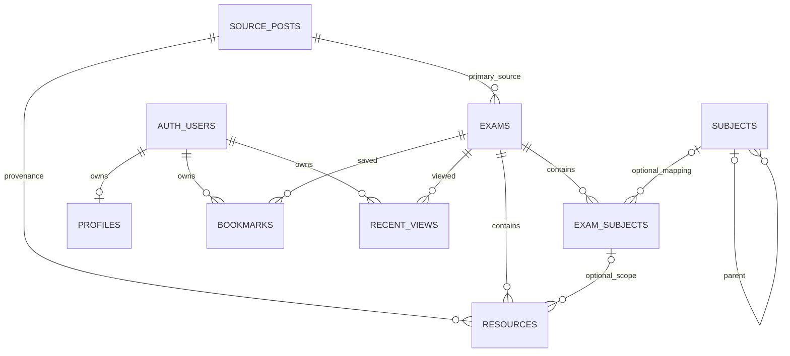

# Database — Data Model v0.1

## Status and boundary

**DRAFT ONLY. Schema designed locally; no Supabase project/migration has been applied.**
No SQL in this proposal was executed, including against a local database. Remote
project existence is unverified; repository files are not evidence of deployment.
The user applies SQL only after review and explicit approval in a later task.

Draft: `supabase/migrations/20260912000100_initial_content_schema.sql`.
This is a forward-only proposal for an empty LegendStudy application schema, not
an idempotent setup script. No Flutter/Supabase SDK integration or seed data.

## Source evidence and modeling consequences

Representative source pages were read on 2026-09-12, not exhaustively crawled:

| Source | Observation | Model consequence |
| --- | --- | --- |
| [2026 May high-school grade 3](https://legendstudy.com/1705) | Multiple math options, paired problem/solution PDFs, Box-hosted English listening, grade-cut images | One exam → multiple subject occurrences → multiple resources; format and purpose are separate |
| [2025 September / 2026 academic-year assessment](https://legendstudy.com/1686) | Title explicitly distinguishes calendar and academic years; exam date September 3, 2025 | `year=2025`, `academic_year=2026`; publication time is separate from exam date |
| [2019 September grade 2](https://legendstudy.com/1415) | Separate math 가형/나형 labels, English audio and script links; a social-science heading contains inconsistent subject names | Preserve original labels; conflicting evidence requires review, not forced mapping |

The requested “2026 September” is an example, not a verified record. Case A below
uses the inspected 2026 May exam. No future/unobserved exam or missing attachment
is invented. File labels/links were observed; binary MIME, byte size, playback,
permanent URL stability and exhaustive resource counts were not verified.

## Entity relationships

Personal data references `auth.users` directly; a missing/deleted optional profile
does not prevent bookmarks or recent views. Auth users are supplied by Supabase,
not created by this migration.

A post can yield zero, one, or many exams; **no unique FK on `exams.source_post_id`**.
Each exam has one primary source and resources can cite another source post.
There is no automatic cross-post exam deduplication: trusted ingestion reconciles
an additional source to an existing exam when evidence is sufficient. A separate
exam/source association table is deferred until multi-source exam-level metadata
needs it. No `exam.pdf_url` shortcut.

## Tables, columns and integrity

All application primary keys are UUID. Except `profiles.id` (the auth UUID),
new IDs default to `gen_random_uuid()`. User IDs are never copied from another
project. `created_at`/`updated_at` use `timestamptz`; six mutable tables share a
schema-qualified `set_updated_at` trigger. Bookmarks only have `created_at`;
recent views only need server-stamped `viewed_at`.

### source_posts — backend-only source identity

- `source`, nullable `external_post_id`, canonical `url`, exact `title`, `category`.
- `source_published_at` and `source_updated_at` describe the website; local
  `created_at`/`updated_at` describe ingestion, avoiding the ambiguous duplicate
  `updated_at` proposed in the task outline.
- Minimal `raw_excerpt`, object `raw_metadata`, optional SHA-256 `content_hash`,
  `parser_version`, `last_crawled_at`, and `source_status` (unknown/available/missing/error).
- `UNIQUE(source, external_post_id)` and `UNIQUE(url)`. Missing external IDs remain
  NULL and resolve by canonical URL. Identity conflicts are quarantined, not merged blindly.
- Raw metadata is private: observation labels, parser diagnostics and original URL,
  never credentials, session tokens, student data or full HTML by default.

### exams — a normalized exam/session

- Required `source_post_id`, stable `source_exam_key`, `slug`, `title`.
- Nullable `year` (calendar year), `academic_year` (source-labelled academic/CSAT
  year), `exam_month` (nominal session), `exam_date` (actual date), `exam_round`.
  `exam_month` need not equal the actual date's month: exams can be postponed.
  If calendar year and date are both known, a CHECK enforces agreement.
- Nullable integer `grade_level` in 1/2/3; unknown/other uses NULL plus
  `raw_grade_label`. Grade 3 includes source-designated exams also taken by graduates.
- Nullable `exam_type` with TEXT + CHECK: `school_assessment`, `national_mock`,
  `evaluation_mock`, `csat`, `preliminary`, `other`; always retain `raw_exam_type`.
  “전국연합학력평가” can map to national_mock after review; “학력평가” alone is not
  enough to distinguish institution/type. `other` means known out-of-list type;
  NULL means unknown. Preserve disagreement in `normalization_note`.
- Nullable `curriculum_version`, `published_at`; publication is not an exam date
  and is not an ingestion timestamp. Do not infer curriculum solely from a year.
- `UNIQUE(source_post_id, source_exam_key)` makes multiple exams per post possible;
  slug is a unique display route, not the ingestion key. All content starts inactive.

### subjects — curated versioned taxonomy

- `code`, `name`, optional `category`, required `taxonomy_version`, optional
  `curriculum_version`, optional `parent_id`, `sort_order`, `is_active`.
- Unique `(taxonomy_version, code)`. `(id, taxonomy_version)` supports composite
  foreign keys that prevent cross-version mappings/parents.
- `taxonomy_version` is our classification release, not automatically an official
  curriculum name. Treat an accepted taxonomy release as immutable; corrections
  that change meaning create a new version and explicit remapping.
- `parent_id` is an optional display/filter grouping. Self-parent is forbidden;
  longer cycles require trusted taxonomy validation before writes. Public reads
  depend on the subject's own activity; deactivating a category is not an implicit
  subtree operation. Ingestion must explicitly deactivate descendants if desired.

Comparison: putting every observed label into the master causes duplicate/false
modern categories; raw-only labels cannot support cross-exam filtering. Chosen
hybrid: keep every observed label on `exam_subjects`; add historical master terms
only after review. 가형/나형 remain distinct and are never silently treated as
modern electives. A reviewed historical taxonomy may later introduce dedicated
codes. No taxonomy seeds or unverified curriculum assignments in this draft.

### exam_subjects — a source occurrence, not just a join key

- `exam_id`, stable `source_subject_key`, nullable `raw_subject_label` (NULL when
  the source has none), optional `subject_id` + `taxonomy_version`.
- Composite mapping FK uses MATCH FULL: both mapping columns NULL or both valid.
- `mapping_status` unmapped/provisional/verified, confidence 0..1, `mapping_note`,
  `mapping_rule_version`, `display_order`, `is_active`.
- Unmapped requires NULL subject/confidence; mapped requires a non-NULL confidence.
  Numeric confidence is parser/reviewer evidence, not calibrated probability.
  Notes and raw labels on public tables must be safe for public exposure.
- Unique `(exam_id, source_subject_key)` rather than `(exam_id, subject_id)`:
  two legacy occurrences must not collapse just because both map to a broad category
  or both have NULL mappings. Do not duplicate normalized subject code here; join
  the master to avoid code/ID drift. Unmapped active rows may still display raw labels.

### resources — attachments and navigable resource links

- Required `exam_id`, provenance `source_post_id`, stable `source_resource_key`,
  `title`, observed `source_url`; optional original `source_label`.
- Optional `exam_subject_id`; composite FK `(exam_subject_id, exam_id)` guarantees
  a scoped resource belongs to the same exam. NULL means exam-wide (e.g. a combined
  grade-cut sheet), not “missing foreign key”. Same file shared by several subjects
  is exam-wide in v0.1; do not duplicate binaries or invent one preferred subject.
- TEXT + CHECK `resource_type`: question/answer/explanation/answer_explanation/
  listening_audio/listening_script/grade_cut/reference/other. Purpose does not
  imply a PDF: grade cuts may be images and listening can be a landing page.
- `source_url` preserves original href; `link_kind` file/landing_page/unknown;
  optional `file_url` only for a verified direct binary endpoint, **not a mirror**.
- Nullable MIME, extension, exact byte size; no made-up byte count from rounded
  website size text. Raw displayed size belongs in source metadata.
- `link_status` unchecked/available/broken/restricted, `last_checked_at`,
  `display_order`, `is_active`. A transient failed probe does not hard-delete data.
- Unique `(exam_id, source_post_id, source_resource_key)`; stable key does not use
  source ordering, title, mutable signed URL query or normalized taxonomy.

PostgreSQL ENUM would require type migrations on new values; TEXT + named/table
CHECKs keep v0.1 readable and extendable with reviewed constraint changes.
Do not accept arbitrary unvalidated type strings or expand “other” silently.

Mirroring is deferred: later add a resource-location/storage table, leaving original
source URLs immutable as provenance. No bucket, storage policy, `is_mirrored`,
redundant `is_external`, or mandatory file-copy assumption is added now. URL CHECKs
are basic shape checks, **not an SSRF defense**; trusted link fetching requires a
host/redirect/IP validation policy before implementation.

### profiles / bookmarks / recent_views

- Profiles: auth UUID `id`, optional display name (trimmed length 1..80), optional
  grade 1/2/3, timestamps. No email, birthday, school, real name, phone or auth trigger.
  Create the profile explicitly on first edit; auth account creation is unaffected.
- Bookmarks: UUID `id`, auth `user_id`, `exam_id`, server `created_at`, unique
  `(user_id, exam_id)`. Insert/delete semantics; use ON CONFLICT DO NOTHING for
  repeated saves. Do not use a merge-upsert that requires bookmark UPDATE rights.
- Recent views: UUID `id`, auth `user_id`, `exam_id`, `viewed_at`, same unique pair.
  Upsert updates one row's latest timestamp rather than adding analytics events.
  The trigger always uses server time and rejects actual changes to the identity
  pair. UPDATE grants include unchanged conflict-key columns for PostgREST upsert
  compatibility. UUID `id` and bookmark timestamp cannot be supplied/rewritten by clients.
- Profiles use INSERT then UPDATE of editable columns; the client must not blindly
  upsert all profile columns, as IDs/timestamps are not client-updateable.
- Deleting a profile removes only that profile. Deleting an auth user cascades to
  all three personal tables. All content/provenance FKs and content references
  from personal rows use RESTRICT: unpublishing is the normal content operation.

## RLS / grants

| Table | anon | authenticated | Trusted backend |
| --- | --- | --- | --- |
| source_posts | none | none | service_role CRUD |
| exams, subjects | SELECT own `is_active` | same SELECT; no content writes | service_role CRUD |
| exam_subjects | SELECT active row + active exam + active mapped subject (or unmapped) | same | service_role CRUD |
| resources | SELECT active row + active exam + visible subject occurrence if scoped | same | service_role CRUD |
| profiles | none | own SELECT/INSERT/UPDATE/DELETE | service_role CRUD |
| bookmarks | none | own SELECT/INSERT/DELETE | service_role CRUD |
| recent_views | none | own SELECT/INSERT/UPDATE/DELETE | service_role CRUD |

All eight tables enable RLS and revoke default PUBLIC/anon/authenticated privileges
before granting the explicit minimum. No client INSERT/UPDATE/DELETE policy on
content or provenance. Policies use explicit roles and `(select auth.uid())`.
UPDATE checks both old-row USING and new-row WITH CHECK. Personal INSERT and
recent UPDATE additionally require a visible active exam. Owners can read/delete
personal rows for hidden exams; joins return no hidden content and clients display
“unavailable”. This preserves deletion capability without leaking catalog details.

Content policy dependencies are acyclic: resources → exam_subjects → exams/subjects.
No SECURITY DEFINER read helper or view bypasses RLS. Trigger functions are
SECURITY INVOKER, schema-qualified, fixed empty search_path, and revoked for direct
client invocation. SQL runtime/trigger privilege behavior remains a later test gate.
Supabase's service_role BYPASSRLS is relied on for trusted ingestion only; constraints
and triggers still apply. Never distribute this credential to Flutter.

## Query-led indexes and pagination

In addition to PK and unique-constraint indexes, the draft adds 11 indexes:

| Index | Query / integrity need |
| --- | --- |
| exams_active_feed `(year DESC NULLS LAST, id DESC)` | Active latest-exam feed; tie-break by UUID |
| exams_active_filters `(grade_level, year DESC, exam_type, exam_month)` | Grade/year-first browsing; remaining filters narrow candidates |
| exams_title_search GIN title `gin_trgm_ops` | Parameterized title ILIKE search, including Korean substrings |
| subjects_parent `(parent_id, taxonomy_version)` | Parent traversal and FK deletion checks |
| exam_subjects_subject_exam `(subject_id, exam_id)` | Subject → exam filter and FK lookup |
| resources_subject_exam `(exam_subject_id, exam_id)` | Scoped resources and composite FK check |
| resources_source_post `(source_post_id)` | Source reprocessing and FK lookup |
| bookmarks_owner_recency `(user_id, created_at DESC, id DESC)` | Saved list keyset pagination |
| bookmarks_exam `(exam_id)` | Content FK deletion checks |
| recent_views_owner_recency `(user_id, viewed_at DESC, id DESC)` | Recent list keyset pagination |
| recent_views_exam `(exam_id)` | Content FK deletion checks |

Unique indexes already start with source_post_id on exams, exam_id on occurrences
and resources, and user_id on personal tables. Do not add redundant standalone
indexes on year/month/type/grade preemptively. Unscoped year uses the feed index;
type-only/month-only paths may scan the small catalog and need EXPLAIN after import.

Title search is a v0.1 baseline, not Korean morphology or attachment full-text search.
One-/two-character patterns may not benefit from trigrams. Add raw-subject/resource
text search only after query profiling; map subject filters through exam_subjects.
No untrusted string interpolation in SQL; escape LIKE wildcards for literal search.

Use bounded pages (e.g. 30 items) and keyset cursors. Feed order includes nullable
year: a known-year cursor must also admit NULL-year rows; after a NULL-year cursor,
only NULL-year rows with smaller UUIDs remain. Use year + UUID, never UUID alone.
Personal cursors use timestamp + UUID. A recent item can move between pages when
viewed again: deduplicate IDs, refresh rather than promise a stable analytics snapshot.
Details/resources are fetched separately to avoid paginating a multiplying join.

## Representative mapping cases (illustrative, not seed inserts)

Example IDs (`E-A`, `S-A`, etc.) below are documentation aliases, not SQL UUIDs.
Normalized values are design proposals requiring ingestion review; original labels
and observed links are evidence. Unless explicitly observed, dates, MIME, size,
curriculum and direct file endpoints stay NULL.

### Case A — recent 2026 exam

Source [post 1705](https://legendstudy.com/1705): 2026 May grade-3 assessment.
`source_posts`: source=legendstudy, external_post_id=1705, canonical URL above.
`exams E-A`: source_exam_key=`session-1` (persisted segmentation key), year=2026,
academic_year=2026 (explicit source heading), exam_month=5, exam_date=2026-05-07,
grade_level=3, exam_type=national_mock, raw_exam_type=전국연합학력평가.
Math labels such as 수학(기하), 수학(미적), 수학(확통) become separate occurrences;
each can own a question and answer_explanation resource. Unknown curriculum or
mapping stays NULL. Grade-cut image resources may be exam-wide until scope is reviewed.

### Case B — legacy math 가형 / 나형

Source [post 1415](https://legendstudy.com/1415): year=2019, academic_year=2019,
exam_month=9, exam_date=2019-09-04, grade_level=2. The source wording supports
national_mock, subject to parser review. Two occurrences `S-GA`, `S-NA` retain
`raw_subject_label=수학 가형` and `수학 나형`, with distinct persisted source keys,
`subject_id=NULL`, `taxonomy_version=NULL`, `mapping_status=unmapped`,
`mapping_confidence=NULL`. Each has separate question/answer_explanation resources.
Later reviewed historical mappings can be attached without changing occurrence or
resource IDs. Never replace these labels with modern math electives.

### Case C — English audio and listening script

The same [post 1415](https://legendstudy.com/1415) has English question,
answer/explanation, audio and script entries. They share one English occurrence
on the existing exam; Case C does not create a duplicate exam/source post.
`listening_audio` preserves the observed Box href, `link_kind=landing_page`,
`file_url=NULL`, `mime_type=NULL`, `link_status=unchecked`. A separately observed
script resource has `resource_type=listening_script`, its original attachment href
and label; its extension may be recorded as source-labelled pdf, not verified MIME.
Playback and byte-level link checks remain pending.

### Extra date and cardinality checks

[Post 1686](https://legendstudy.com/1686) yields year=2025, academic_year=2026,
exam_month=9, exam_date=2025-09-03. “2026학년도” must not enter calendar year.
A future verified multi-exam post uses two stable source_exam_key values under one
source_post_id; unique slug and source keys prevent duplicate reprocessing. A
resource scoped to a different exam's occurrence fails the composite FK.

## Static review and future validation gates

Day 3 validation is parser-only and manual structural review, **not a DB test**.
`pglast` parses SQL and PL/pgSQL without executing it. The checked-in
`supabase/review/check_schema_draft.py` verifies table/RLS/policy inventory,
content write grants, owner checks, FK shape and absence of seed inserts.
It cannot validate catalog resolution, permissions, RLS behavior, query plans,
PostgREST upsert behavior or real constraint enforcement. These remain unverified.

After explicit authorization in a separate task, reviewers should test:

| Scenario | Required outcome |
| --- | --- |
| anon active/inactive content, inactive exam with active resource | only active visible hierarchy returns |
| inactive mapped subject vs unmapped occurrence | mapped row/resource hidden; unmapped active row still visible |
| anon/authenticated source_posts read and content writes (including TRUNCATE) | denied by grants, no mutation |
| user A versus B SELECT/UPDATE/DELETE personal rows | B's rows invisible/unchanged; own writes confirmed via RETURNING |
| null auth.uid(), forged INSERT owner, changing owner | denied; no rows created/transferred |
| save/view hidden exam vs existing personal row after hide | new save/view denied; own old row readable/deletable |
| repeat bookmark, repeat recent upsert | one row per pair; latest server viewed_at; unchanged UUID |
| recent upsert through PostgREST | unchanged keys accepted; actual key changes and forged timestamp prevented |
| same post repeated / reordered / normalized again | stable IDs and counts; new type/URL does not duplicate attachment |
| resource/subject cross-exam or cross-taxonomy | rejected by composite FK; no orphan content |
| auth-user delete vs profile delete vs source/exam delete | personal cascade / only profile / RESTRICT respectively |
| missing date/month/grade/mapping | accepted with raw evidence, not guessed normalization |
| reviewed taxonomy hierarchy | no cycles and explicit publication of intended nodes |
| extension schema, trigger execution, role grants | resolve in target Supabase environment before acceptance |

See `supabase/README.md` for prerequisites, read-only future inspection, and
rollback considerations. No DB results or deployment success are claimed.

## Deferred extensions / open questions

- `ingestion_runs`: defer table; structured file reports initially record run_id,
  parser version, counts, failures and timing. Decide persistence with the parser.
- Broader historical taxonomy releases, cross-post exam reconciliation, subject
  hierarchy cycle enforcement, resource multi-subject assignments and row-retention
  policy require real backfill evidence. Non-exam 논술 material can remain in source_posts
  until its separate normalization scope is defined; do not force every post into exams.
- Default all content inactive until source/provenance and links are reviewed.
  Publication thresholds, dead-link grace period and raw metadata size budget remain
  operator decisions. Do not delete or unpublish on one fetch failure.
- Storage mirrors, search service/morphology, analytics, notifications, community,
  school database, ads/IAP and other v2 entities are intentionally absent.

## Technical references

- [Supabase RLS](https://supabase.com/docs/guides/database/postgres/row-level-security):
  explicit grants/roles, USING + WITH CHECK, authenticated ownership and service-role boundary.
- [PostgreSQL constraints](https://www.postgresql.org/docs/current/ddl-constraints.html):
  unique/FK/CHECK and composite foreign-key null behavior.
- [PostgreSQL pg_trgm](https://www.postgresql.org/docs/current/pgtrgm.html):
  GIN ILIKE support and short-pattern limits; benchmark against imported data.
