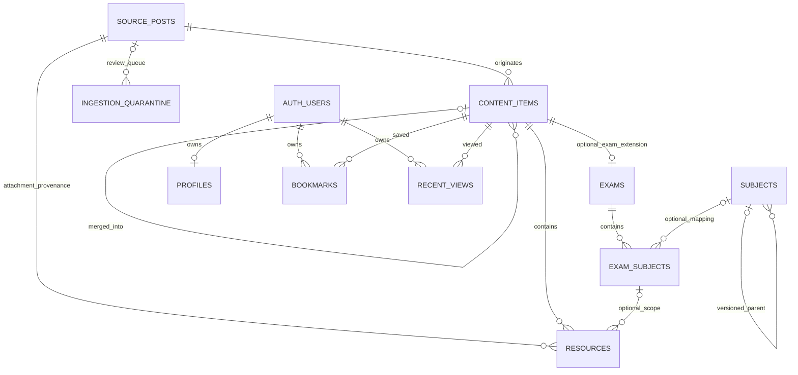

# Database — Data Model v0.1 / Unified Content

## Status and execution boundary

**DRAFT ONLY, NOT DEPLOYED.** The owner confirms the LegendStudy Supabase project
has not been created or linked. No local/remote SQL or PL/pgSQL was executed; no
DB connection, project lookup, import, seed or SDK integration was performed.
Only the existing `supabase/migrations/20260912000100_initial_content_schema.sql`
is revised. This is a forward migration for an empty application schema, not a
replay-safe script. A DRAFT comment does not prevent future CLI execution.
Application requires a later explicit authorization and LegendStudy project-ref
verification. Never use another project's database/configuration.

The previous exam-centric draft is superseded **before deployment**. Search,
Home, Saved and Recent target content_items. Source posts stay private provenance;
exams only extends exam-type content. No production data needs conversion now.

## Entity relationships and same-content integrity

`exams.content_item_id` is its **shared primary key**, not a second UUID. It gives
one content item zero or one exam extension. A stored generated `exams.content_type`
constant `'exam'`, plus composite FK `(content_item_id, content_type)` referencing
`content_items(id, content_type)`, prevents an exam extension for a column/study/
essay item and prevents changing a parent's type while the extension remains.
The discriminator is an integrity mechanism, not another editable taxonomy.

`exam_subjects.content_item_id` directly references `exams(content_item_id)`.
`resources.content_item_id` references the common parent. Optional scoped FK
`resources(exam_subject_id, content_item_id)` →
`exam_subjects(id, content_item_id)` preserves the prior cross-exam protection.
An occurrence cannot belong to non-exam content; a resource cannot borrow another
content's occurrence. No redundant exam_id or copied parent ID is needed. Unscoped
resources have NULL exam_subject_id and work for **any** content type. All content
FKs DELETE RESTRICT and UPDATE NO ACTION; only auth-user deletions cascade.

## Tables and identity

### source_posts — backend ingestion/provenance only

UUID id; required source, external_post_id, url, title; optional category,
source_published_at/source_updated_at, raw_excerpt, object raw_metadata,
SHA-256 content_hash, parser_version, last_crawled_at; source_status
unknown/available/missing/error; local created_at/updated_at.

For LegendStudy, numeric post IDs are mandatory. The sole source conflict target
is `(source, external_post_id)`; UNIQUE(url) is a collision guard, not identity.
Verified location changes UPDATE the same source row. Missing IDs/conflicting
identity are quarantined, never resolved by a URL fallback. Supporting ID-less
sources would require a later reviewed migration. No client API exposes this table.

### content_items — public content, routes and publication

UUID id; required source_post_id (RESTRICT), source_content_key, slug, content_type,
title, source_url; optional summary, published_at, source_updated_at, thumbnail_url;
stored generated feed_updated_at; is_active defaults false; optional
merged_into_content_item_id (self FK RESTRICT); local created_at/updated_at.

- UNIQUE(source_post_id, source_content_key) permits several semantic items per post.
  Single content uses `main`; multiple items use stable source-based keys such as
  grade3, morning, essay-2019. Never array positions, display order, title hashes or
  mutable taxonomy. source_content_key matches `^[a-z0-9]+(-[a-z0-9]+)*$`.
- First slug is `legendstudy-{external_post_id}-{source_content_key}`. It is unique,
  ASCII lowercase/hyphen and immutable to automated reprocessing. Former exam keys
  migrate conceptually to the common key; `legendstudy-1705-main` stays unchanged.
  No remaining exams.source_exam_key, slug, title or source_post_id.
- Canonical types: `exam`, `study_material`, `education_column`, `university_essay`,
  `admissions_info`, `other`. national_mock/csat etc. belong only in exams.exam_type.
  New canonical types need a reviewed CHECK migration, not restructuring all children.
- `source_url` is the public original-post link; source_posts need not be joined.
  It is a curated public projection synchronized atomically with verified source
  location changes. Attachment resources retain their own source URL/provenance.
- `summary` is a short reviewed public description, not copied full article HTML.
  Thumbnail is optional and only populated from verified safe source evidence.
  Classification diagnostics/raw category evidence remain in private raw_metadata
  keyed by source_content_key or quarantine, not extra public classification fields.
- **is_active is the sole parent publication flag.** Exams has no duplicate flag.
  Before publishing an exam item, trusted ingestion requires its reviewed extension;
  the DB relationship deliberately remains 1:0..1, so publication completeness is
  an ingestion validation gate, not a cross-table CHECK.
- Merge state moved from exams to this common parent as merged_into_content_item_id.
  CHECK forbids self-merge and active duplicates; canonical items have no pointer.
  Trusted logic validates compatible types and longer cycles, reconciles personal
  conflicts and retains inactive duplicate rows. No automatic migration/delete trigger.

### exams — specialized metadata

Shared content_item_id PK; generated type discriminator; optional calendar year,
academic_year, nominal exam_month, actual exam_date, generated sort_date,
grade_level, raw_grade_label, exam_type, raw_exam_type, exam_round,
curriculum_version, normalization_note; created_at/updated_at.

Years are 1900..2200; month 1..12; grade 1/2/3 or NULL with raw evidence. Unknown
values are never guessed. Grade 3 may include source-designated exams taken by
graduates. year is the actual calendar year; academic_year is source-labelled
school/CSAT year. If year and exam_date both exist, their years must agree.
Nominal session month may differ from the actual date after postponement.

exam_type uses TEXT + CHECK: school_assessment, national_mock, evaluation_mock,
csat, preliminary, other. NULL means unknown; other means known out-of-list.
Preserve raw wording and uncertainty; do not infer curriculum solely from year.

Stored sort_date is an **exam-list sorting proxy**, not historical evidence:
exam_date → first day of known year/month → January 1 of known year → NULL.
It uses current-row values and immutable pg_catalog.make_date. It is separate from
Home's source publication/update clock. UUID only breaks ties.

### subjects / exam_subjects — preserve historical taxonomy

Subjects: UUID id, code (lowercase/underscore), name, optional category,
required taxonomy_version, optional curriculum_version/parent_id, is_active,
sort_order >= 0, timestamps. UNIQUE(taxonomy_version, code) and UNIQUE(id,
taxonomy_version). Parent/version composite FK prevents cross-version parentage;
self-parent CHECK plus trusted longer-cycle validation. Released meaning is
immutable; semantic changes require reviewed releases, not silent remapping.

Occurrences: UUID id, content_item_id FK to exams, source_subject_key,
nullable subject_id/raw_subject_label/taxonomy_version, mapping_status,
confidence 0..1, private note/rule version/verified_at, display_order >= 0,
is_active false, timestamps. UNIQUE(content_item_id, source_subject_key), not
subject_id: separate raw occurrences cannot collapse into one broad mapping.
UNIQUE(id, content_item_id) supports resource scope integrity. Mapping composite
FK uses MATCH FULL, so subject_id/version are either both NULL or both valid.

| State | Mapping pair | Confidence | verified_at |
| --- | --- | --- | --- |
| unmapped | both NULL | NULL | NULL |
| unmappable (human reviewed, current taxonomy insufficient) | both NULL | NULL | NULL |
| provisional | valid pair | required | NULL |
| verified | valid pair | optional | required |

Human unmappable review context/time belongs in quarantine resolution. No
verified_by/auth reviewer coupling. Confidence is evidence, not calibrated
probability. Automated ingestion cannot update an existing verified occurrence
**by contract**; service_role is not blocked by a special trigger. Before actual
ingestion, review an enforcement migration/management workflow. See ingestion.md.

Historical 가형/나형 remain raw labels, never silently modern electives. Inactive
taxonomy hides only its master row. Active occurrences/resources remain available
with raw-label fallback; clients must use optional left joins, not inner joins.

### resources — attachments for every content type

UUID id; mandatory content_item_id and provenance source_post_id; stable
source_resource_key; nullable exam_subject_id; resource_type, title, optional
source_label; source_url; link_kind file/landing_page/unknown; optional verified
file_url, mime_type, extension, exact nonnegative size; link_status
unchecked/available/broken/restricted, last_checked_at; display_order, is_active,
timestamps. The public column list below excludes internal diagnostics.

Purposes remain question, answer, explanation, answer_explanation, listening_audio,
listening_script, grade_cut, reference, other. Purpose does not imply binary format.
A Box link can be an audio landing page; do not invent direct MP3 endpoints/MIME.
NULL scope is content-wide and also supports non-exam PDFs. No mirrors/buckets now.

UNIQUE(content_item_id, source_post_id, source_resource_key). Original attachment
identity must be deterministic, independent of title/order/signed query. Distinct
identities colliding on same content + normalized source URL go to quarantine;
no URL UNIQUE without evidence that legitimate reuse is impossible. Provenance
correction reconciles the same UUID explicitly. Case-insensitive HTTP(S) CHECKs
on source/file/thumbnail URLs are shape checks only; future fetching validates
allowed hosts, redirect hops and resolved IPs, rejecting private/link-local targets.

### profiles / bookmarks / recent_views

Profiles unchanged: auth UUID id PK with DELETE CASCADE, optional display_name
(trimmed 1..80 characters), grade_level, timestamps. No email/school/interest array,
auth trigger or mandatory profile. Client creates/edits explicitly.

Bookmarks/recent views: UUID id, auth user_id (DELETE CASCADE), mandatory
content_item_id (DELETE RESTRICT), UNIQUE(user_id, content_item_id). They target
all types, including columns without exams/resources. Bookmark created_at is
server default; recent viewed_at is always trigger-stamped. The trigger rejects
actual user/content key changes, allows unchanged keys, and keeps the row UUID.

Profile POST merge-upsert sends id/display_name/grade_level with conflict target id.
INSERT/UPDATE grants include id so unchanged-key upsert is allowed; USING and WITH
CHECK enforce ownership. Recent POST merge-upsert sends **only** user_id and
content_item_id with that conflict target; omit id/viewed_at. UPDATE grants only
those keys. Bookmark repeated saves use ignore-duplicates, not merge-update.
Do not use all-column PUT or personal timestamps supplied by clients. Verify the
actual PostgREST release later. Profile deletion affects only the optional profile;
auth-user deletion cascades all personal rows. Hidden content leaves owner-readable,
owner-deletable personal rows with an unavailable content join.

### ingestion_quarantine — backend review queue

UUID id, nullable source_post_id FK RESTRICT, nonempty kind, object payload default
{}, status open/resolved/ignored default open, note, created_at, resolved_at. Open
requires NULL resolution time; resolved/ignored require one. No client grant/policy
or update trigger. Classification/segmentation/resource conflicts are persisted
with bounded non-sensitive evidence. Failed batches record quarantine separately
so the evidence survives rollback. No full HTML, tokens or personal student data.

## RLS and exact public projections

All **10 tables** enable RLS; explicit REVOKE precedes grants. **16 policies,
10 non-constraint indexes, 8 triggers, 2 functions; 74 migration statements.**

| Table | Public SELECT rows | Client writes |
| --- | --- | --- |
| source_posts, ingestion_quarantine | none | none |
| content_items | active | none |
| exams | active parent content | none |
| subjects | own active master row | none |
| exam_subjects | own active + active content parent | none |
| resources | own active + active content + active same-content occurrence if scoped | none |
| profiles | authenticated owner | own INSERT/UPDATE/DELETE |
| bookmarks | authenticated owner | own INSERT/DELETE |
| recent_views | authenticated owner | own INSERT/UPDATE/DELETE |

Personal INSERT and recent UPDATE additionally require active content. Policies
qualify parent keys explicitly. Occurrence FK already ensures exam specialization;
resource visibility never joins taxonomy. Dependency direction is resources →
occurrences → content_items, exams → content_items; no recursive policy cycle.

RLS controls rows; column grants control disclosure. service_role has CRUD on all
tables and is expected to BYPASSRLS, while constraints/triggers still apply. Its
credential never enters Flutter. Two invoker clock functions have empty search_path
and direct EXECUTE revoked from PUBLIC/anon/authenticated. Actual inherited/default
ACL and trigger behavior are future validation, not inferred from these files.

Public SELECT columns (explicit nested projections, **never wildcard SELECT**):

| Table | Columns |
| --- | --- |
| content_items | id, slug, content_type, title, summary, source_url, published_at, source_updated_at, feed_updated_at, thumbnail_url, is_active |
| exams | content_item_id, content_type, year, academic_year, exam_month, exam_date, sort_date, grade_level, exam_type, exam_round, curriculum_version |
| subjects | id, code, name, category, taxonomy_version, curriculum_version, parent_id, sort_order, is_active |
| exam_subjects | id, content_item_id, subject_id, raw_subject_label, taxonomy_version, mapping_status, display_order, is_active |
| resources | id, content_item_id, exam_subject_id, resource_type, title, source_label, source_url, link_kind, file_url, mime_type, file_extension, file_size, display_order, is_active |

`is_active` is intentionally public for invoker policy subqueries. The fixed exam
content_type is also public so PostgREST can join the composite discriminator FK. Source keys,
merge pointer, raw normalization notes, classification evidence, link-check status
and internal timestamps are hidden. Source URL/summary are safe public projections.

## Indexes and query boundaries

| Non-constraint index | Definition |
| --- | --- |
| content_items_active_feed | `content_items (feed_updated_at desc nulls last, id desc) where is_active` |
| exams_date_sort | `exams (sort_date desc nulls last, content_item_id desc)` |
| subjects_parent | `subjects (parent_id, taxonomy_version)` |
| exam_subjects_mapping | `exam_subjects (subject_id, taxonomy_version)` |
| resources_subject_content | `resources (exam_subject_id, content_item_id)` |
| resources_source_post | `resources (source_post_id)` |
| bookmarks_owner_recency | `bookmarks (user_id, created_at desc, id desc)` |
| bookmarks_content | `bookmarks (content_item_id)` |
| recent_views_owner_recency | `recent_views (user_id, viewed_at desc, id desc)` |
| recent_views_content | `recent_views (content_item_id)` |

All ten are btree. Exam sort has no partial activity predicate because publication
belongs to content_items. The exam shared PK supports parent lookup. Existing
unique prefixes cover source→content, content→occurrences/resources and owner
keys. The mapping index is on the referencing table; subjects' referenced UNIQUE
cannot replace it. Rare merge/quarantine lookups initially scan. No pg_trgm,
extensions schema, broad filters index, vector/search service or speculative indexes.

**Unified search returns content_items cards.** Parameterized ILIKE over title and
optional summary; bounded tokens can each match title OR summary (AND between
tokens). Literal search escapes LIKE wildcards. Do not interpolate user SQL.
Content filters: type and published date. Exam filters: calendar/academic year,
grade, exam type and subject through exams/exam_subjects EXISTS/inner filtering
only when explicitly requested. These filters intentionally narrow results to
exam content. Fetch a single page of parents before optional details/resources;
avoid fan-out joins that duplicate cards or produce incorrect limits.

Examples: `2026 5월 고3` matches an exam parent's title/summary (explicit year/grade
filters use metadata); `연세대 논술` matches an essay parent; source-backed admissions
and study-material titles are searchable with no exam join. No promise of Korean
morphology or semantic search. Measure after import before any search-index migration.

**Home “recent updates” means latest known original-source publication/modification.**
`feed_updated_at = greatest(published_at, source_updated_at)` is generated: one NULL
uses the known timestamp, both NULL stays NULL, an older modification timestamp
cannot move the feed behind publication. Local created_at/updated_at and crawl time
never drive Home. Reprocessing the same input must not bump feed position. If the
source has no reliable modification time, changed resources still update in place
but Home retains the publication fallback; never invent a source update timestamp.
This is not a feed of latest app ingestion events. All types share one active-parent
query ordered feed_updated_at DESC NULLS LAST, id DESC.

For non-NULL cursor (t,i): `feed_updated_at < t OR (feed_updated_at = t AND id < i)
OR feed_updated_at IS NULL`; for NULL: `feed_updated_at IS NULL AND id < i`.
Use identical original filters, bound parameters and bounded pages. Exam lists
instead order sort_date DESC NULLS LAST, content_item_id DESC with the same null-tail
rule. UUID is only a tiebreaker. Content corrections and recent-view writes can
move rows; deduplicate/refresh rather than promise snapshot pagination.

## Five representative cases — observed pages, proposed mappings, no seed

Pages were read on 2026-09-12. Only visible text/link evidence was inspected, not
attachment bytes, MIME, exact size, playback, timestamps or exhaustive archive
coverage. Content types below are reviewed modeling proposals, not source labels
or existing DB rows. Unknown facts remain NULL.

### A — recent exam

[Post 1705](https://legendstudy.com/1705) describes the 2026 May grade-3 assessment
with subject PDFs, listening and grade-cut material. Source 1705 → content
`main`, slug `legendstudy-1705-main`, type exam → shared-ID exam extension →
occurrences/resources. Calendar year 2026, nominal month 5, observed exam date
2026-05-07; retain raw type/grade evidence. Source publication clock stays separate.
[Post 1686](https://legendstudy.com/1686) separately illustrates calendar 2025 versus
academic 2026; never place “2026학년도” into calendar year merely from the title.

### B — historical math plus English audio/script

[Post 1415](https://legendstudy.com/1415): one exam content for 2019 September grade 2.
Keep separate raw 가형/나형 occurrences, initially unmapped with NULL subject/version/
confidence. English audio/script attach to its English occurrence; a Box href is
landing_page until direct bytes are verified. This does not create extra exam or
content rows merely for additional attachments. Historical labels survive remapping.

### C — general study PDF, no exam row

[Post 991](https://legendstudy.com/991) provides a multi-year English question-type
practice collection with a linked PDF. Model as study_material, key main, one
content parent and an unscoped reference resource. It aggregates several exams;
forcing one exam year/session would be misleading. No invented vocabulary PDF.

### D — education/admissions column, no required exam or resource

[Post 927](https://legendstudy.com/927) discusses admissions strategy for the 2017
cycle. Model as education_column with title, short reviewed summary, original-post
URL and known publication time only. A native card/detail can open the original
externally; no stored full article body or fabricated download is required.
This is historical content, not current admissions advice. Factual admissions news
can use admissions_info after classification review.

### E — university essay, no exam extension

[Post 1612](https://legendstudy.com/1612) has Yonsei 2023-admission-cycle essay problem
and explanation PDFs (conducted in 2022). Model university_essay → unscoped resources;
preserve admission-year wording in title/summary, not exams.year. [Post 1610](https://legendstudy.com/1610)
contains two admission years, showing why one speculative university/year pair is
not enough for every post.

Comparison: nullable university_name/admission_year fields on every content row
would be simple but sparse and cannot represent multi-year collections safely.
A later university_essay_metadata relation can handle typed/multiple-year needs,
but current filters only need source-backed university/year title/summary search.
Choose neither extra columns nor extra table now; preserve candidate metadata in
private evidence. Semantic year-specific content splitting is allowed when source
blocks and independent card needs justify it, never by array position. No university
master, department database or admissions prediction schema.

## Reprocessing, soft merge and deferred scope

See ingestion.md for detection → classification → parent upsert → type parser →
validation/quarantine → publication. New answers/grade cuts update the same parent
and existing resource identities. Source deletion/broken links use reviewed soft
states, never automatic hard delete. Content merges reconcile all personal content
references; retain inactive duplicate content and its extension/provenance.

Notifications remain v1.0 product scope; device tokens/preferences/delivery schema
are deferred to a later v1.0 milestone. No profile interest arrays. No article-body
schema, storage mirrors, ingestion_runs table, seed taxonomy or Flutter changes.
Initial runs emit bounded private reports; unresolved issues persist in quarantine.

## Offline validation and future authorized runtime acceptance

The checked-in checker parses SQL and PL/pgSQL, compares policy/index/trigger ASTs,
exact client grants, shared PK/type discriminator, same-content FK chain, source
identity, mapping CHECKs and immutable verified ingestion contract. Mutation tests
reject parent visibility bypasses, exam-only personal targets, cross-content scope
weakening and feed clock changes. SELECT-only inspection SQL is parsed, never run.

**PASS means offline grammar/structure only.** It does not prove catalog resolution,
RLS, actual Supabase ACLs, PostgREST, trigger execution, FK enforcement or performance.
The future approved LegendStudy deployment must test:

1. All six content types; active/inactive parent against every child and client role;
   column-only projections/nested joins versus forbidden SELECT * and private tables.
2. Exam extension only on type exam, shared PK uniqueness, non-exam unscoped PDFs,
   cross-content occurrence/resource rejection and type-change FK rejection.
3. Inactive taxonomy leaves raw occurrences/scoped resources visible; composite
   version mapping and unmappable/provisional/verified confidence/time constraints.
4. User A/B ownership, null auth, profile upsert, bookmark ignore-duplicates and
   recent key-only upsert for columns/study/essay/exams; forbidden owner/key/time edits.
5. Generated feed/date/discriminator compatibility, both-NULL/one-NULL/older update
   clocks and cursor transitions; same-input reprocessing must not bump Home.
6. Same/modified source, added answers, signed URL changes, partial failures,
   concurrent workers, verified exclusion, classification/type corrections,
   durable quarantine and conflict-safe soft merges with no cycles.
7. Catalog/role/default ACLs, auth.users REFERENCES, service_role BYPASSRLS,
   function EXECUTE, all triggers/FKs, schema cache and measured query plans.

Technical basis: [GREATEST null semantics](https://www.postgresql.org/docs/17/functions-conditional.html#FUNCTIONS-GREATEST-LEAST),
[PostgreSQL 17 generated columns](https://www.postgresql.org/docs/17/ddl-generated-columns.html),
[make_date catalog entry](https://raw.githubusercontent.com/postgres/postgres/REL_17_STABLE/src/include/catalog/pg_proc.dat)
and [immutable catalog default](https://raw.githubusercontent.com/postgres/postgres/REL_17_STABLE/src/include/catalog/pg_proc.h).
PostgREST's [POST upsert/on_conflict contract](https://docs.postgrest.org/en/stable/references/api/tables_views.html#upsert)
informs narrow payloads; actual server behavior remains untested. Target server
version is unknown because the project does not exist. See supabase/README.md.

### Final checker hardening — schema unchanged (2026-09-13)

The offline gate now locks slug/global URL uniqueness, required values, all four
publication DEFAULT false flags, date-input ranges and reviewed domain/order CHECKs.
The existing migration remains unchanged. Runtime fallback options are documented
in supabase/README.md and require an observed target failure plus separate review.

The final query in initial_content_schema_checks.sql reports active content_items
with content_type=exam and no exams extension. Expected result is zero rows during
future authorized pre-publication inspection. It detects missing reverse existence;
it adds no DB constraint/trigger and was not executed. Inspection now has 16
SELECT statements; parser PASS still does not establish actual runtime correctness.
