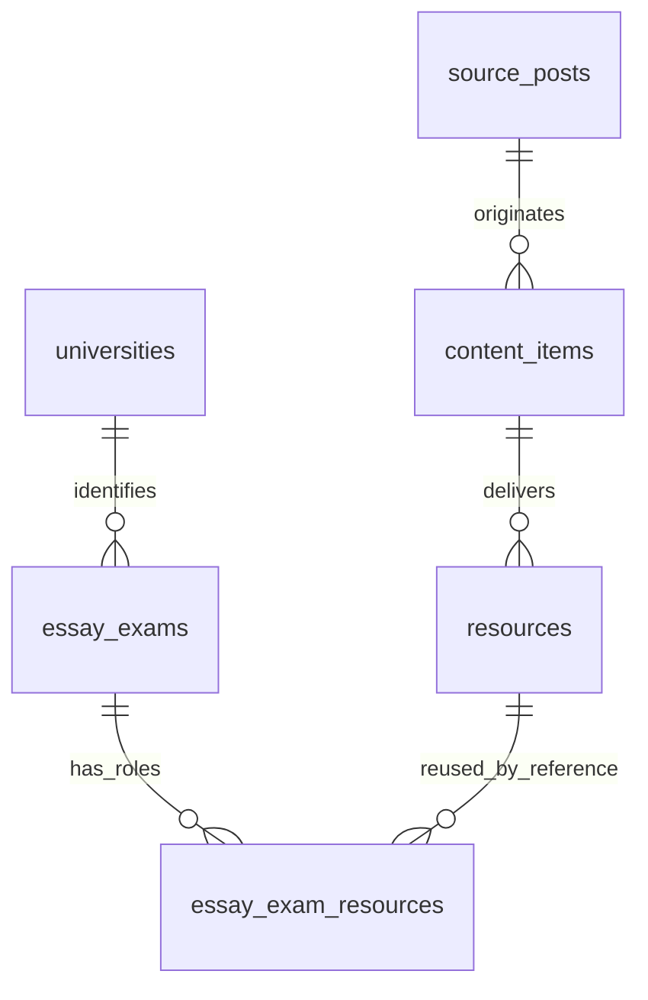

# Essay LAB Data Foundation v1 — 2025 Pilot

Status: **FOUNDATION APPLIED / THREE-UNIVERSITY PILOT PASS**, 2026-09-27.

Latest: [Pilot Phase1 continuation](essay-lab-pilot-2025.md): Production3 universities,
19 active verified exams,121 official verified mappings reusing38 resources. Owner
resolved3 document-year conflicts; original notes preserved. Owner closed both optional answer-subtype reviews: keep existing roles, no
example_answer addition. [SKKU Evidence Package v1](essay-lab-evidence-package-v1.md)
is ready for review; no AI execution. No schema change. Historical design/promotion statements below are prior checkpoints.

Owner's new explicit instruction opens this design task. Materials device QA remains
pending; this is not a claim that Materials is CLOSED. P0 Essay LAB precedes score
analytics. No Materials audit, UI, AI grading, Production migration or seed here.

## Objective and scope

“간결하게 구현하되 정확하게 작동하게 한다.” Model a real essay exam independently
of its blog posts/files. Exactly admission_year **2025**, six universities:
연세대학교, 성균관대학교, 중앙대학교, 경희대학교, 부산대학교, 경북대학교.
No 2020–2024/2026 structuring, 17-university expansion or user-learning tables.

Source lineage stays `source_posts → content_items → resources`. Reuse existing
resource UUIDs, PDFs and opening contract. One post can contain several exams;
several posts can contribute to one exam. Source publication date is never an
admission-year fallback. Public source availability is not AI/reuse authorization.

Related canonical context: [Materials handoff](materials-closeout-essay-lab-handoff.md),
[Personalization](personalization-onboarding.md), [Database](database.md),
[Essay roadmap](roadmap-essay-lab.md), [Longitudinal strategy](longitudinal-learning-admissions-data-strategy.md).

## Actual inspection and existing Manus reuse

Starting branch `codex/day-7-school-neis`, starting HEAD `b20889d`; local/origin
matched. Owner iOS files were dirty before work and remain untouched. Existing
untracked Claude outputs, Supabase temp and Python caches are not staged.

Live project `stlhijzpjfgwwdgunlsd` inspected in an explicitly **READ ONLY** SQL
transaction, rolled back. Actual 21 public tables have RLS. No universities or
Essay canonical tables exist. Current `resources.id`, `content_items.id` are UUID
PKs; resources reference content and source with DELETE RESTRICT. `profiles` is
user-owned and has no canonical university master. `subjects` is the school/mock
subject taxonomy, not a university taxonomy. Existing clock function
`public.set_updated_at()` is available. No changes to these objects are proposed.

Public guest GET independently returned the exact 55 active resources of the six
selected posts. No resource-resolver invocation (it can consume quota), private
profile records, signed URL output, source downloads or PDF text extraction.

Inspectable evidence: [Pilot fixture](../tool/essay_lab/pilot_2025_inspection.json)
contains timestamp, public IDs/titles/keys, year/role candidates, schema/FK/RLS
snapshot and hashes of reused LAB files. This is metadata evidence, **not a seed**.

Read-only reuse from sibling `legendstudy-lab` repository:

- `src/types/domain.ts`: university/campus/admission context; provenance labels.
- `src/fixtures/public-metadata.ts`: five reviewed public metadata fixtures,
  including `pnu` and `knu`; checked dates/official archive links, mostly 2027 context.
- `docs/DATA_BOUNDARIES.md`, `docs/PROTOTYPE_MIGRATION.md`,
  `docs/FUTURE_IMPLEMENTATION_HANDOFF.md`: public vs private evidence, synthetic
  UX, Web-first workspace and private evaluation-package boundaries.

Owner's 42-university / 53-recruitment-row research master and
university × recruitment campus × admission track grain are reused as **design
context**. The full master is not present in the inspected local LAB repository;
only its reviewed subset is available. No claim that all 53 rows were inspected.
No broad research repeated. No 2027 fixture is silently converted to a 2025 fact.
`HUMAN_REVIEWED` becomes verification status, not a fourth source origin;
`MODEL_DERIVED` maps conceptually to `ai_generated`, never official. Synthetic
workspace examples remain tests, not imported university data. LAB repo unchanged.

## 2025 Pilot findings

Counts distinguish all attachments in a matching post from **2025 exam attachments**.
A 2025 competition label or admissions guide does not make a 2024 paper a 2025 exam.
All groups/roles below are **filename/title candidates**, not verified PDF contents.
Official scope-specific 2025 document verification: **NOT PERFORMED / UNKNOWN** for
all six; inherited official archive links alone do not verify a paper or role.

| University | Selected source posts | All resources | 2025 exam resources | 2025 admission guides | Outside-year attachments |
|---|---|---:|---:|---:|---:|
| Yonsei | 1671 | 12 | 11 | 0 | 1 |
| Sungkyunkwan | 1689 | 9 | 9 | 0 | 0 |
| Chung-Ang | none found | 0 | 0 | 0 | 0 |
| Kyung Hee | 1633, 1682 | 20 | 18 | 1 | 1 |
| Pusan | 1658, **guide context only** | 7 | 0 | 1 | 6 |
| Kyungpook | 1657 | 7 | 6 | 1 | 0 |
| Total | 6 context posts; **5 exam posts** | **55** | **44** | **3** | **8** |

- **Yonsei:** regular humanities, natural, natural additional sitting; mock natural
  (4 candidate groups). Separate question/intent/explanation documents and a mock
  explanation+answer file. Additional sitting must not collapse into natural main.
  2026 guide excluded. Generic answer subtype, campus/track and exact date UNKNOWN.
- **Sungkyunkwan:** regular humanities1/2, natural1/2/3 (5 combined question+answer
  files), mock humanities/language and natural/math (2 split pairs): 7 candidate
  groups. Title mentions criteria; file contents/criteria/pages still UNKNOWN.
- **Chung-Ang:** no active 2025 exam or 2025 guide found in inspected university
  materials. Do not invent an exam or reinterpret 2024 mock/2023 papers. Source
  supplementation belongs to Manus/Owner's later mapping phase, not a new crawl.
- **Kyung Hee:** regular social, humanities/sports, natural, medicine/pharmacy:
  4 combined question+answer files. Mock has 7 question/answer pairs: social,
  humanities/sports, natural, plus medicine math/physics/chemistry/biology. Treat
  those four medicine components as sections pending exam-set identity review,
  not automatically four independent exams. 4 broad mock candidate families;
  exact sessions/elective combinations UNKNOWN. Post1682's 2026 mock file excluded.
- **Pusan:** post1658 has six **2024** paper files and one 2025 admissions guide.
  Zero confirmed 2025 exam attachments. Busan1593 is a **2024** guidebook and does
  not fill this gap. No resource/openability changes in this task.
- **Kyungpook:** 2025 **mock** AAT humanities/natural1/natural2: 3 split question
  and explanation+answer pairs, plus a guide. Regular 2025 exam not established.
  Generic answers are not asserted to be model/example/high-scoring answers.

No verified high-scoring answer, model/example answer subtype or rubric claim is
made. Guidebook/multi-year guidebook presence **within this 2025 sample** is not
established; admissions guides are not automatically exam guidebooks. These gaps
are mapping/source availability issues, not reasons to add new schema entities.

Publication vs admission-year regression: post1633 was published in **2024**, its
15 files are labelled **2025학년도**. Post1658's 2025 title suffix does not change
its six 2024 papers. Post1683's 2025 competition suffix does not change 2026 mocks.

## Minimal canonical model



Hierarchy: University → campus/admission context where necessary → admission year
→ track → real exam/session → role mappings. Year is a column; campus/track/field
are nullable university-specific labels, not new master tables. No department
master, analysis taxonomy or admission-results schema now.

| New table | Purpose and key columns | Integrity / relationships |
|---|---|---|
| `universities` | UUID `id`, stable unique `slug`, `name`, inactive default, timestamps | Platform-wide FK for Onboarding/MY/LAB/모집요강/입결/School/Analytics. `pnu`/`knu` preserve existing LAB vocabulary; Web IDs require explicit mapping, not a new account model |
| `essay_exams` | University FK, `admission_year`, stable `exam_key`, name, kind, nullable campus/track/field/session; nullable date/duration/question_count/answer_length_text/exam_format | UUID PK + UNIQUE university/year/key; context metadata is non-unique; UUID independent of source content; DELETE RESTRICT |
| `essay_exam_resources` | Exam FK, existing resource FK, role, origin, review status, citation locator, official source URL, evidence note, timestamps/active | PK `(essay_exam_id, resource_id, role)` permits multi-role and many files per role; same resource may link to multiple exams/years |

**Existing-table columns added: 0.** Resource binary duplication: NO. No new
source/content/resource row, URL mirror or storage bucket. Common source URL/title,
publication date/content and source keys remain in existing tables; public lookup
joins content, backend provenance may additionally join private source_posts.

### Identity contract

Owner/ChatGPT review decision: **UUID PK + UNIQUE
(university_id, admission_year, exam_key)** is the canonical identity contract.
The earlier draft's `essay_exams_verified_context` partial UNIQUE index has been
removed before any deployment. Campus/track/field/session (and exam kind) are
context metadata, not additional uniqueness constraints. The same context labels
may describe distinct exams with different stable keys. NULL context remains
unknown/not supplied; it is not coerced to a reviewed shared identity.

`exam_key` is assigned once after exam identity reconciliation, never regenerated
from a filename, source post ID, title or array position. Context corrections do
not change the UUID/key. Similar context is a review signal, never a merge command.

`exam_kind = admission / mock / other` is needed by actual Yonsei/SKKU/KNU files.
Session is separate from field (e.g. natural main vs additional; humanities1/2).
No `exam_date.year = admission_year` CHECK: the examination can occur in the prior
calendar year. No school/mock `public.exams` reuse: its shared content PK and
`content_type = exam` invariant are incompatible with Essay many-source identity.

Campus/track labels describe the **recruitment context**, not necessarily the exam
venue. A confirmed shared paper can have a reviewed shared context label; do not
create artificial duplicates for every campus. An authoritative many-to-many
recruitment/program association, if later needed, can reference the same exam UUID
without replacing it. It is not implemented from uncertain Pilot metadata.

### Facts, provenance and verification

Origins: `official`, `legendstudy_derived`, `ai_generated`; NULL means unknown.
Origin describes the evidence/fact, **not the classifier/extractor**. A human review
of generated text does not make it official. Filename candidates have NULL origin
and `review`; no numeric confidence is invented.

Exam metadata row has one origin and a primary `metadata_resource_id` FK and/or
source citation URL plus `evidence_note`. The note identifies supported fields and
scope; additional supporting resources can be linked with role `other`. Never mix
official facts and derived predictions in the same row. This Pilot fills factual
columns only from identified evidence; unknown values stay NULL. Analysis belongs
to a separately approved later layer, not `exam_format` or other factual columns.

Both exams and role mappings default inactive/review. Verification requires origin,
a timestamp and nonempty evidence note; role verification also requires a document
locator. Verified official rows require an official source reference URL. A URL
shape CHECK is not proof of university authority: reviewer must match institution,
year/session and stated evidence scope. Mapping publication requires actual role
content confirmation; a filename containing 답안 cannot select model/example/우수.

Resource roles:
`question`, `passage`, `exam_intent`, `scoring_criteria`, `model_answer`,
`example_answer`, `high_scoring_answer`, `explanation`, `guidebook`, `other`.
Generic 답안 remains `other`/review until its subtype is established. A combined
PDF has multiple mapping rows to the **same UUID**, not a forced split or copy.
A per-role `source_locator text` already supports page/section/question references,
e.g. `PDF pp. 3-4; section II; question 2(a), passage B`, or multiple disjoint
references in the same role row. Verify each exam/year scope when reusing a guide.
No new column or Question entity is needed now. This is an inspectable citation,
not a machine-addressable Question PK or automatic question retrieval contract;
future Question mapping can reuse the resource/locator without duplicating PDFs.

All new tables contain **public metadata/citations only**. Do not put PDF body,
private Gold rubrics, prompts, reviewer personal information or credentials into
notes/locators. Private evaluation packages remain a separate later boundary.
Public reading/official provenance does not imply AI processing, mirroring,
redistribution or commercial rights. A future rights register can attach to
existing resource IDs; no legal decision or blanket rights flag is invented now.

## RLS, SQL and deterministic evidence

[Formal migration](../supabase/migrations/20260927000200_essay_lab_foundation.sql)
is **PREPARED / NOT APPLIED**. The [finalized review copy](../supabase/review/essay_lab/001_foundation.draft.sql)
has an identical SQL body; execute the formal migration only, never both copies.
Only the approved three tables/indexes/policies/clock triggers are created. No seed,
backfill, existing-table ALTER, data UPDATE/DELETE or source mutation.

- Public/anon/authenticated: SELECT only. Active university → verified active
  exam → verified active mapping → existing visible resource. Existing resource
  RLS already checks its active content and optional active subject.
- Clients receive no INSERT/UPDATE/DELETE grant or policy. Existing backend
  `service_role` writes only under a future separate authorization gate.
- Replay guards: tables/indexes IF NOT EXISTS; policies replaced only on the new
  tables; clock triggers CREATE OR REPLACE. Replay of an identical definition is
  intended; this does **not** repair drift. Before promotion/replay compare actual
  definitions and unexpected policies/grants, abort on mismatch. Runtime replay
  has not been executed. New migration `20260927000200` follows repository
  `20260927000100`; file presence is not Production deployment evidence.

[Read-only lookup](../supabase/review/essay_lab/evidence_lookup.sql) selects mappings
for `$1 = essay_exam_id`, official + verified + active only, with visible parents.
Stable role/resource ordering; no inferred missing answers. Run under public client
roles so existing RLS applies; explicit parent guards also cover backend preview.
Private source_posts is not exposed. New-schema query itself is **not executed**.

[Offline manifest contract](../tool/essay_lab/evidence_preview.py) tests reference
selection/order/missing roles, not ingestion or a deployed API. Caller supplies a
verified visible exam and visible resource IDs. Duplicate mappings reject rather
than choose a winner. A synthetic example proves one PDF may supply question,
passage and criteria while another supplies a second question resource; fixtures
are clearly synthetic mappings, never Pilot official evidence assertions.

**Deterministic evidence lookup structurally ready: YES. Actual verified Pilot
Evidence Sets ready: NO (zero mapped/verified exams).** All requested official
roles are representable. Missing capability: exact question/passage extraction,
exam/role/page verification, rights review and private evaluation package are later
work. No claim that AI can grade from the current package.

## Edge cases and future connections

| Case | Model support / actual evidence boundary |
|---|---|
| Question-only PDF; split question/answer | Same exam, distinct resource mappings. Present as filename patterns in Yonsei/KNU/KHU |
| Combined question/answer/explanation | Multiple role rows per UUID. Question+answer labels in SKKU/KHU; precise inner roles UNKNOWN |
| Intent + criteria + example in one PDF | Supported by same PK. Exact combined content NOT VERIFIED in this inspection |
| Morning/afternoon, field or additional sitting | field and session separate. Yonsei additional/SKKU numbered families present; morning/afternoon not independently verified |
| Multi-year PDF / guide spans several exams | Reuse same UUID across year-specific exam IDs with scoped locators. No multi-year 2025 guide verified here |
| Missing document / unknown role | Exam stays review or lacks that mapping; other/review retains uncertain evidence. Do not invent resources |

The table name is **public.universities**, a LegendStudy platform-wide canonical
university master, never Essay-specific. Onboarding/MY/LAB/모집요강/입결/School/Analytics
will use this same university_id; no duplicate department-specific university master.
School integration here does not replace the existing NEIS secondary-school identity.
University UUID is ready for future shared FK joins;
no current profile or UI modification. Department/track masters, 모집요강/입결
structure and user submissions/feedback/revisions remain future separately reviewed
work. The FK anchor is ready; those features are **not implemented**.

## Validation and decision gate

Reproduce offline checks (existing dependency pin `pglast==8.4`):

```sh
python3 -m venv /tmp/legendstudy-essay-review-venv
/tmp/legendstudy-essay-review-venv/bin/pip install -r supabase/review/requirements.txt
PYTHONPATH=tool /tmp/legendstudy-essay-review-venv/bin/python -m unittest tool/test_essay_lab_foundation.py -v
/tmp/legendstudy-essay-review-venv/bin/python supabase/review/check_schema_draft.py
python3 tool/check_wiki_handoff.py
git diff --check
```

17 new offline tests PASS: SQL AST/FK/unique/check/RLS/static replay/no data DML,
live-name snapshot collision, real 55-resource/44-exam-file year boundaries,
missing Pusan/Chung-Ang, generic-answer uncertainty, repeat/order invariance,
multi-role/multi-resource/multi-year isolation, exclusion of review/generated/
invisible evidence, duplicate rejection. Existing schema checker and its16 schema/Study
regression tests PASS (33 tests total).
Parser reports PostgreSQL18 grammar; draft syntax used is compatible with existing
PG17 features, but that is static review, not execution proof.
Native PostgreSQL execution/RLS/replay: **NOT_RUN — local psql/initdb/pg_ctl absent;
Production execution prohibited.** Flutter: NOT_RUN, no Flutter/UI files changed.
No new runtime regression claim; no runtime code/schema was deployed.
Wiki handoff PASS (current-status11829 bytes); diff whitespace check PASS;
secret-shaped token scan PASS on9 scoped files. Owner iOS and accepted-state
SHA256 values match the precheck. These checks do not assert exhaustive secret
detection or native PostgreSQL runtime behavior.

**SCHEMA_REVIEW: APPROVED.** Owner corrections are finalized in the formal migration.
No fourth table, Pilot seed, Question entity or AI implementation.
No Production apply in this task; Owner execution is the next separate step. Before actual mapping, obtain missing
2025 Chung-Ang/Pusan paper sources and KNU regular paper if regular coverage is
required; reuse Manus assets rather than repeating the 42-university research.
Confirm exact campus/track/session labels and whether shared exam contexts need
recruitment associations. Missing data does not block reviewing this schema.

Next, only after separate approval: Phase A six-university 2025 mappings → Phase B
2–3 rich exam Evidence Sets/retrieval → Phase C benchmarked feedback prototype →
Pilot corrections → scope expansion → new2026 year → historical years. Owner
handles2026 acquisition and ambiguous Product decisions, not hundreds of manual
role entries. High-confidence mapping can later be proposed automatically; this
package implements no auto classifier or mass extraction.

PRODUCTION_MUTATION:NO · MIGRATION_APPLIED:NO · PRODUCTION_SEED:NO ·
RESOURCE_BINARY_DUPLICATION:NO · USER_SUBMISSIONS/FEEDBACK/PAYMENT_TABLES:NO.
Accepted-state/1710, Materials, onboarding, Owner files and LAB repo preserved.

**NEXT: Owner Production-apply gate. STOP before execution.**


## Owner application package — approved schema, execution pending

All three requested checks are complete:

1. `public.universities` is the platform master; naming unchanged, scope explicit.
2. Removed context UNIQUE; UUID PK + university/year/stable-key UNIQUE retained.
3. Existing text locator supports page/section/question citations; no extra schema.

Owner execution order, **only when choosing to apply**:

1. Open the LegendStudy project `stlhijzpjfgwwdgunlsd` SQL Editor. Do not use another
   project or run blanket `supabase db push` for this package.
2. Run [preflight.sql](../supabase/review/essay_lab/preflight.sql). Expected new-table
   names NULL, UUID resources PK and clock function present, all3 roles present,
   service_role BYPASSRLS true. If any target already exists, STOP and compare
   definitions; IF NOT EXISTS is not safe reconciliation of an older draft.
3. Run the **entire** [20260927000200 migration](../supabase/migrations/20260927000200_essay_lab_foundation.sql)
   once, including BEGIN/COMMIT. No seed follows it. SQL Editor application and CLI
   migration history are distinct; record actual execution before any later CLI sync.
4. Run [validate.sql](../supabase/review/essay_lab/validate.sql). Expected:3 RLS-enabled
   tables, all row counts0;4 RESTRICT FKs; university slug + exam stable-key uniqueness;
   mapping composite PK; context unique indexes0;3 public SELECT policies; public
   write privileges false; service CRUD true;3 clock triggers; locator TEXT.
5. Return preflight/apply/validation results. Catalog/grant checks do not establish
   real JWT row-isolation behavior. Runtime fixtures/seed remain a separate gate.

Failure/rollback: the migration is one transaction; on error ROLLBACK the failed
transaction and report the error. After a successful commit, retain the empty
inactive tables if validation fails and STOP; do not DROP tables, delete source
rows or seed to mask failures. Any post-commit correction gets a reviewed forward
migration. No destructive rollback script is included.

Promotion checks:19 focused tests PASS (including finalized-copy equality,
context-uniqueness exclusion, text locator and read-only validation SQL). Existing
schema/Study16 regression tests PASS. SQL has been parsed only, not executed.
Production apply, seed and runtime RLS/replay validation: **NOT_RUN**.

Promotion live READ ONLY check: all3 target relations remain absent; existing
resources/clock prerequisite present. No DDL, INSERT, UPDATE or DELETE executed.


## Official evidence archive strategy — Owner decision 2026-09-30

**Canonical source/ingestion architecture decision; documentation only.** Owner reports
holding more than10 years of historical university essay PDFs, including originals of
materials previously posted on legendstudy.com; **2026학년도 is excluded** from that archive.
This is an Owner inventory statement, not a file-by-file provenance or completeness audit.
No archive file was opened, ingested, moved or copied in this task.

### Source priority and immutable pipeline

1. Owner-held university official PDF originals, after publisher/year/type/provenance verification.
2. Latest official documents obtained directly from university websites.
3. Web research to verify original existence/version or identify missing material.
4. Blogs/secondary material for discovery/reference only.

Custody by Owner does not establish official origin. Do not repeatedly search/download/rebuild
originals already in the repository or supplied by Owner. Preserve university publisher,
admission year versus publication year, document type, acquisition context and verification
state. The official-source URL and resource delivery URL distinction below still applies;
a missing exact source URL is a review item, never a fabricated URL or blog attribution.

**Raw official PDF → file identity/hash → page/source locator → structured extraction →
human/review validation → canonical evidence → frozen evaluation package → AI evaluation.**
The raw PDF remains the Source of Truth; extracted text is a versioned derivative and never
replaces it. This is an Official Evidence Knowledge Base, not PDF fine-tuning. Select verified
question-specific evidence at evaluation time; do not send the entire archive to a model.

Existing universities/exams/resources/exam mappings/question evidence/criterion identities
remain reuse targets, not duplicate masters. Earlier blog lineage describes existing ingested
records, not a requirement to re-scrape blogs or invent blog posts for Owner archives. Exact
direct-PDF linkage, schema coverage and role/version constraints require later ingestion
architecture review; this decision changes no current enum, table, locator or DB row.

### Evidence distinctions for the next architecture review

| Proposed evidence type (conceptual, not a deployed enum) | Meaning |
|---|---|
| question / passage | Task and source passages |
| exam_intent | Official purpose and intended competencies |
| scoring_criteria / scoring_weights | Normative requirements versus explicit allocation |
| length_requirement | Wording/length requested on the question paper |
| length_scoring_rule | Separately verified official tolerance/deduction/scoring treatment |
| evaluation_notes | Official evaluation guidance and caveats |
| explicit_non_criteria | Features explicitly excluded from grading or prohibited in judgment |
| official_example_answer | Official illustrative answer; calibration, not a required template |
| accepted_student_example | Officially supplied accepted/excellent student answer; calibration |
| other official guidance | Other verified directions, classified with review |

Question length and scoring treatment must never be collapsed. A question saying1,200
characters does not establish its deduction threshold or tolerance. Store/report an actual
scoring rule only after exact official-source verification; no numeric tolerance is invented here.
Positive requirements and explicit non-criteria must both reach future evidence packages.
Absence of a positive requirement alone is not an explicit prohibition: preserve source scope.

Preserve **all** official examples when several exist, with separate identity/locator and
provenance. Official rubric is normative; accepted/excellent examples are calibration evidence.
They demonstrate multiple successful arguments and expressions, not one correct template.
Do not grade wording/structure similarity to an example. Preservation in the Knowledge Base
is separate from disclosure to a blind evaluation: reference answers remain excluded from
current frozen provider input; calibration/reviewer access needs a separately reviewed policy.

### Owner Human Review findings and next version

Owner's L2-B2 Claude Human Review reports the following Hanyang findings. They are recorded
as Owner findings, not a new Codex inspection of official PDFs or a retroactive Pilot rescore:

- Prior automated/web-based acquisition was incomplete; two accepted examples existed but
  were not sufficiently represented in the earlier package.
- A readable portion of the manuscript had been transcribed as unreadable. Original and
  transcription uncertainty can disagree; the transcription is not the higher authority.
- The question's1,200-character instruction and separate official length/scoring treatment
  require distinct evidence.
- Official guidance excluded introduction/body/conclusion form from evaluation, yet Claude
  criticized missing conclusion as a structural weakness. Explicit non-criteria were needed.

For the **next prompt/evidence/contract version**, strongly prefer1–2 core tasks; use3 only
when independent and necessary in the same rewrite. Zero remains valid for a strong answer.
Retain other findings in detailed diagnosis/history. Minor spelling/spacing/repetition must
not outrank central task/content deficits. Do not criticize absence of a conclusion itself
when official criteria do not require that form. First recognize a student's officially
permitted evaluation direction, then distinguish insufficient application/argument support.
Never turn uncertain reading into a student grammar/logic error. This is a review direction,
not a changed parser cap or an executed prompt upgrade.

### Transcription and correction history

Preserve original PDF/image and transcription together. Use an unreadable marker only where
reasonable reading is actually difficult; faint handwriting, low OCR confidence or model
hesitation alone is insufficient. Where original and transcript disagree, review the original.
Plan extraction method/version, confidence, review state and linked correction history.
Corrections must retain the original extraction and its evaluation-package lineage; never
silently overwrite old transcription or pretend a historical model saw corrected input.
Confidence is diagnostic metadata, not proof of a student error or source truth.

### Historical batches and yearly updates

Later historical ingestion uses bounded Owner-archive batches: university → admission year →
admission track/division → exam → question → question/passages → intent → criteria → weights →
length/scoring rules → official/accepted examples → other guidance. Validate duplicate files,
revisions, missing coverage and misclassification at each stage before canonical admission.

For new yearly data: official university sites → discovery candidates → compare with existing
dataset → new/changed candidates → extraction → validation/review → approved canonical
registration. A web agent assists discovery/updates; it does not manufacture source truth.
2026학년도 is a separate latest-data acquisition target, using the same provenance/evidence
contract. No acquisition or scheduling is authorized now. Archive-first reuse reduces agent
work, repeat collection and web cost; it never removes validation or rights/privacy review.

### Frozen comparison and longitudinal boundary

Current L2-B2 packages, prompts, transcriptions, images and Claude outputs remain immutable.
Any later **separately authorized** GPT Supplemental must use the same frozen conditions,
even where this review identifies defects. Corrected evidence/prompt belongs to a new version
and a separate improvement experiment. This document does not authorize Supplemental calls,
reset consumed slots, select a model or change billing/revision limits.

Seven preservation answers: (1) acquisition/extraction/review/correction are distinct dated
facts; (2) raw hashes/locators/context preserve traceability; (3) retain prior extraction and
package versions rather than silent UPDATE; (4) official evidence does not create a student
identity, while private attempt identity remains unchanged; (5) source/calibration evidence
is not a student's Learning/Decision/Outcome fact or marketing telemetry; (6) source rights,
example-answer privacy, access and retention require review—possession is not clearance;
(7) extraction/confidence/quality judgments are derivatives, not original truth. No student
body is copied into this Wiki or marketing properties.

Next: resolve OpenAI quota → separately authorized frozen GPT comparison → Owner model
comparison → primary model decision → Official Evidence Ingestion implementation planning.
No ingestion, code/DB/migration/Production change or AI/provider call in this documentation task.

## Official Source Policy — Owner decision 2026-09-28

University admission offices / official university archives are the canonical
original sources for official essay questions, passages, intent, criteria, explanations,
example/model/high-scoring answers, guidebooks and other official essay documents.
App and lab.legendstudy.com display: **출처 · ○○대학교 입학처** and
**원문 자료 보기 ↗**. LegendStudy provides discovery, viewer, structuring, analysis and
learning; it does not present university documents as its own authored work.

Use the exact stable official posting URL where verified. If unavailable, a verified
relevant official essay/past-question archive URL is an allowed fallback; record the
fallback scope in existing evidence_note. Do not fabricate a posting URL or imply a
specific document was verified merely because the archive exists. Missing official
URL stays a review item, not a LegendStudy-blog substitution.

Existing schema is sufficient, no migration:
- essay_exam_resources.official_source_url records the specific evidence source;
  essay_exams.official_source_url records the exam-level source. Prefer the verified
  mapping-specific URL; use exam URL only when it genuinely covers that evidence.
- provenance / verification_status / evidence_note distinguish official verified
  facts from derived or AI-generated interpretation. source_locator identifies
  PDF page/section/question/answer without duplicating resources.
- resources.source_url is delivery/viewer access; content_items/source_posts retain
  blog/source lineage. Do not overwrite these as a substitute for official provenance.
- Existing evidence_lookup.sql already returns official_source_url and delivery URL
  separately. Temporary/signed PDF URLs are not canonical official source URLs.

Reused verified posting references from existing Pilot plans (not a new university
research inventory; each link covers the named exam/report, not every university file):

| University | Official reference |
|---|---|
| 숙명여자대학교 | [2025 모의논술](https://admission.sookmyung.ac.kr/admission/html/rolling/previousView.asp?p_board_idx=52111&p_mode=modify) |
| 한양대학교 | [2025 모의논술](https://go.hanyang.ac.kr/web/pds/pds_view.do?bn=14860&m_type=SUSI&ct02=ns02) |
| 성균관대학교 | [2025 정규시험 보고서](https://admission.skku.edu/admission/html/ipsi/noticeView.html?idx=59290) |
| 연세대학교 | [2025 정규시험 보고서](https://admission.yonsei.ac.kr/seoul/admission/html/counsel/dataView.asp?BBS_NO=3356) |
| 경희대학교 | [2025 정규시험 자료](https://iphak.khu.ac.kr/detail.do?board_seq=13928&menuurl=89BGs%2Bk748ajyySWoWlQPw%3D%3D) |

**Attribution does not grant processing, redistribution or commercial-use rights.**
Source/rights review is required before full public release/expansion. Record unresolved
conditions in the review queue; no legal clearance is asserted and no rights framework
is introduced here. UI rendering of this policy is a future implementation obligation,
not an implemented-UI claim from this documentation follow-up.


Student-facing Essay language/evaluation philosophy now follows the
[2026-09-28 Owner policy](essay-lab-hanyang-2024-benchmark.md#student-facing-language-and-evaluation-philosophy--canonical-owner-policy):
Korean teacher-like explanations, achievements first, deduplicated actionable
improvements, internal identifiers kept out of student prose. No UI implementation.
