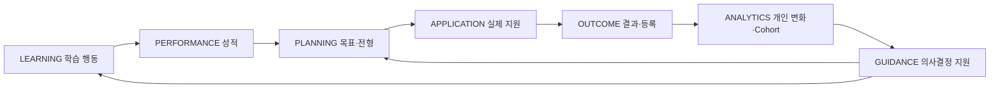

# LegendStudy Longitudinal Learning and Admissions Data Strategy

**Importance: HIGH / CANONICAL PRODUCT STRATEGY**
**Owner decision: 2026-09-24 · Architecture: PLANNED · No implementation authorization**

## Authority and current scope

이 문서는 LegendStudy의 상위 Product / Data / Marketing / Business Strategy다.
단순 아이디어 보관함이 아니라 향후 설계에서 반드시 확인할 원칙이다. 다만 전략의
채택과 기능의 구현·출시·데이터 이용 승인은 서로 다르다. 이 작업은 Wiki만 작성하며
코드, DB/schema/migration, 수집, 분석 실행, Production 변경을 하지 않는다.

필수 적용 영역: DATABASE, STUDY, SCORE, MOCK, MY, LAB, ADMISSIONS, ESSAY,
APPLICATION, OUTCOME, ONBOARDING, MARKETING, ACHIEVEMENT, NOTIFICATIONS,
ANALYTICS, MONETIZATION, B2B. 구현 상태는 [current-status](current-status.md),
릴리스 범위는 [product-scope](product-scope.md)가 관리한다.

| 전략과 기존 결정의 관계 | 유지할 경계 |
|---|---|
| [Product architecture](product-architecture.md) | 동일 canonical 계정/데이터, 제품별 독립 세션, 기존 제품 가족과 개발 순서 보존 |
| [Three-layer allocation](product-architecture.md#academic-analytics-three-layer-allocation--2026-09-24) | MY Snapshot / Mobile LAB Actionable / Web LAB Deep Analysis 유지 |
| [Analytics and Achievement](roadmap-academic-analytics.md) | 공부시간 ≠ 성적 향상의 원인, 공부시간/배지 ≠ 직접 합격확률 입력; 논술 평가와 시험 점수의 척도 분리 |
| [Official and Free Mock](day-8-d2-answer-scoring.md#owner-follow-up-3--dual-practice-modes) | 공식 키로 채점한 연습 결과와 자유 연습 수동 점수 분리; 후자는 현재 공식 MY/LAB/입시 분석에 자동 편입 금지 |
| [Monetization](roadmap-monetization-and-in-app-learning.md) | 무료 자료/Guest 가치 유지; 유료 가치는 분석·연속성, 가격·entitlement는 미확정 |
| [Privacy and deletion](account-deletion-privacy.md) | 기존 삭제/Apple revoke/정책 release gate 유지; 장기 데이터가 권리·삭제 의무를 우회하지 않음 |
| [Research synthesis](research-2026-09-24-product-operations-synthesis.md) | 연구 권고는 증거이며 배포 승인이 아님; Admissions evidence gate 유지; Daily Sync는 별도 작업 |

현재 존재하는 Study 원본/기본 추세, 제한된 Mock 채점 및 개인 결과는 출발점이다.
완전한 Academic Record, Application/Outcome lifecycle, cohort engine, consulting,
predictive model이 구현됐다는 뜻이 아니다. 기존 문서의 역사·결정을 삭제하거나
전략 전체를 v1 필수 범위로 승격하지 않는다.

## Core thesis and data flywheel

**Learning Behavior → Academic Performance → Application → Admission Outcome**를
하나의 longitudinal timeline으로 연결한다. 오래 사용할수록 개인의 학습 행동,
성적 변화, 지원 전략과 실제 결과가 연결된 trajectory가 만들어진다. 여러 해의
trajectory는 적법한 이용 범위와 품질 조건을 갖출 때 cohort dataset이 될 수 있다.

제품 약속 후보: **“기록할수록 나를 더 잘 이해할 수 있는 학습·입시 서비스.”**
수집 자체가 목적이 아니라 기록 → 변화 확인 → 비교 → 분석 → 의사결정으로
사용자에게 가치가 돌아와야 한다.

LegendStudy Data Flywheel:

무료 입시자료 유입 → 앱 설치 → Study Timer / Mock Exam → 내신·모의고사·수능 기록
→ 개인 분석 → 유사 학생 비교 → 목표 대학/학과 → 수시·정시·논술 지원 계획/기록
→ 입시 시뮬레이션 → 실제 지원 → 1단계/최초합/추가합/불합격 기록
→ Outcome Dataset 강화 → 더 유용한 cohort analysis → 사용자 가치
→ 추가 기록과 장기 사용. **각 미래 단계는 해당 gate를 통과한 후 제공한다.**

장기 Data Moat 후보는 자료·타이머·검색·AI라는 개별 기능보다 **학습 행동 × 성적
변화 × 지원 전략 × 실제 Outcome**의 맥락 있는 시계열과 이를 설명하는 신뢰다.
이는 경쟁우위 가설이지 데이터에 대한 무제한 소유권·판매권 주장이 아니다.
사용자 증가 → 비교 가치 → 기록/사용자 증가라는 network effect도 품질 관리가
동반될 때의 가능성이다. 데이터 양 증가가 품질·대표성 향상을 보장하지 않는다.

## Four longitudinal layers

아래는 향후 설계 후보이며 확정 column/table/enum이 아니다. 없는 값은 만들지 않는다.
User → Learning Events → Academic Outcomes → Application Events → Admission
Outcomes 연결을 유지하되 각 domain의 provenance와 척도를 보존한다.

| Layer | 보존할 후보 데이터 | 의미와 경계 |
|---|---|---|
| Learning Behavior | duration, study date/time, frequency, streak, days/week, subject, study mode, mock duration, included/excluded time, completion | 가능한 원본 session/event를 보존; 일/주/월 통계는 파생값. 타이머와 모의고사 원본을 합쳐 덮어쓰지 않음 |
| Academic Performance | academic year, school grade, semester, exam type/date, subject, raw/standard score, percentile, score grade/rank, internal-school context, source, verification | 내신/모의고사/수능의 시점·시험·교육과정·척도 분리. 동일 숫자를 동일 능력으로 가정하지 않음 |
| Application Events | university, department/major/recruitment unit, admission year, track, application type, planned/applied date, stage/status | 수시·정시·논술 실제 지원과 관심/목표/계획을 구분 |
| Admission Outcomes | 응시, 단계 결과, 최초합/추가합/불합격, 등록/포기, announcement/event time, source | 전형별 유효 단계만 사용; 미입력은 불합격이 아님 |

고2 내신 → 고3 내신 → 모의고사 변화 → 학습 변화 → 수능 → 지원 대학/전형 → 결과처럼
연결된 기록의 분석 가치를 지향한다. 연도/학년 전환 후 현재 profile 값으로 과거
event의 맥락을 다시 해석하지 않는다. 동일 canonical identity 원칙을 지키며
분석용 가명 subject는 별도 로그인 계정이나 독립 authoritative user가 아니다.

## Preservation and architecture review

**P0 DATA PRESERVATION**: 지금 필요한 현재 값만 UPDATE하여 미래 분석에 필요한
과거 사실을 잃는 설계를 피한다. 가능한 event history + current projection을
검토한다. 이것은 모든 profile/UI click에 event sourcing을 도입하라는 지시가 아니다.
보존은 목적·최소수집·권리·retention 제약 안에서만 한다.

Time is a first-class dimension: 공부한 때, 시험을 본 때, 성적 발표/기록 시점,
지원한 때, 결과가 난 때를 구분할 수 있어야 한다. 향후 occurred_at와 기록/수정
시점, academic year, 당시 학년, 과목, source, provenance, verification state를
검토한다. 정확한 명칭은 DB 설계에서 결정한다. 현재 KST Study 정책과 taxonomy/
versioned exam-subject/채점 키 계약을 재사용하며 UTC 날짜로 임의 변경하지 않는다.

- 학년·연도·교육과정·학교 내신/모의고사/수능·과목·척도를 숫자와 함께 보존한다.
- 일/주/월/학기/학년 aggregate는 가능한 원본에서 재현한다. 성능용 aggregate table,
  materialized view/cache는 원본 truth를 대체하지 않고 version/refresh를 가진다.
- Raw/Source → Clean/Canonical → Derived Metrics → Cohort Aggregates → Product
  Insights를 구분한다. Product telemetry(UI click)와 learning record(session)는
  다른 domain이다. 마케팅 install/conversion과 학생 성적/지원 원본도 분리한다.
- 초기 warehouse를 만들지 않는다. 규모와 workload가 근거를 제공하면 operational
  DB와 analytics replica/warehouse/ETL·ELT 분리를 검토한다.
- 과거 이력이 이미 없는 경우 생성 시점·결과를 지어내는 backfill은 하지 않는다.
  삭제·정정 때문에 재현 범위가 달라지면 그 한계를 표시한다.

새 schema 기능 전 아래 질문에 답한다. 중요한 손실이 있으면 구현 전 재검토한다.

1. 과거 값/정정 관계가 보존되는가?
2. occurred_at/event time을 알 수 있는가?
3. 당시 academic context가 남는가?
4. source/provenance를 추적할 수 있는가?
5. self-reported와 verified의 범위를 구분하는가?
6. 사용자의 longitudinal timeline에 연결 가능한가?
7. 삭제·정정·Privacy 정책을 적용할 수 있는가?
8. 집단 분석에서 직접 식별자를 분리할 수 있는가?

정식 출시 또는 Score/Application 본격 개발 전 **Longitudinal Data Architecture
Review**를 수행할 계획을 둔다: Study events, score history, academic context,
applications, outcomes, provenance/time, deletion, analytics separation.
이 문서만으로 현재 schema가 모두 충족한다고 인증하지 않는다.

## Personal analytics and study-score comparison

첫 계층은 **“나는 어떻게 변하고 있는가?”**다. 개인 과거와 현재를 비교한다.
후보: 일간/최근7일/주간/월간 공부시간, 학습일수, 평균 session, 연속 학습,
과목별 비중, 전주/전월 차이, 장기 이동평균; 내신/모의고사/수능의 과목별
등급·백분위·표준점수 변화. 기본 추세의 현 구현 범위는 [Study](study-v1.md),
성적 맥락과 제한은 [Academic roadmap](roadmap-academic-analytics.md)이 소유한다.

[Canonical study inclusion](study-v1.md#owner-final-ui-polish--2026-09-24)을 재사용한다.
include_in_study_total=false 모의고사는 공부시간 합계에서 제외하되 응시 기록은
보존한다. Home/MY/LAB/Marketing이 서로 다른 합계 정의를 쓰지 않는다.

Study × Score는 시험 전 4/8주 공부량·과목별 시간·학습일수와 성적 변화를 연결하는
후보다. 2/4/6/8주 lag window는 후속 설계 대상이며 현재 구현하지 않는다.
다른 시험 난도/척도를 raw score만으로 직접 비교하지 않는다. Snapshot(이번 주 차이)
과 Historical insight(8주간 차이 변화)를 구분해 자기 변화도 충분히 보여준다.

## Correlation guardrail

**Correlation ≠ Causation**은 최상위 원칙이다. “함께 상승했다”, “동행하는 패턴이
관찰됐다”, “유사 cohort에서 이런 패턴이 있었다”는 적절한 데이터가 있을 때의
descriptive 표현이다. 공부시간 때문에 성적이 올랐다거나 몇 시간 공부하면 몇 점
상승한다는 단정, 검증되지 않은 효과 크기는 금지한다.

기초 성적, 학년/과목, 시험 난도, 학원/과외, 시험까지 남은 기간, 학교 유형,
교육과정/전형 변화, 자기선택 편향, 결과 입력 편향을 고려할 후보로 둔다.
이 모두를 수집하거나 완전히 통제할 수 있다는 뜻이 아니다. 설명되지 않은
confounding과 불확실성을 남긴다. 논술 첨삭 사용량과 합격의 관계도 같은 제약을 받는다.

비교에서 자주 관찰되는 행동을 반드시 따라야 할 처방으로 바꾸지 않는다.
학생의 목표·선택을 지원하며 “이 대학에 지원해야 한다”는 자동 결정을 하지 않는다.
공부시간은 학습 진단용이며 **입시 합격확률의 직접 predictor가 아니다**.

## Cohort analytics and minimum cohort

둘째 계층은 **“나와 비슷한 학생들은 어떤가?”**다. 후보 정의는 같은 학년,
비슷한 내신/모의고사 성적, 같은 과목 성적대, 목표 대학군, 지원 전형,
동일 대학/학과 지원자다. 상승군/유지군/하락군 비교도 후보이며 비교 가능한 시험과
기간, 분류 정의가 선행되어야 한다.

**MINIMUM_COHORT_SIZE: REQUIRED / N TBD — Privacy and Statistics review.**
작은 cohort는 제공하지 않는다. 기준이 확정되고 충족되기 전 공개를 허용하지 않는다.
개인 입력이 완전해도 전체 표본이 부족하면 “비슷한 학생 데이터가 아직 충분하지
않아요.”를 표시한다. 가짜 평균·percentile·count를 만들지 않는다.

Cohort Registry 후보: definition, version, minimum sample size, observation window,
exclusion rule, quality threshold. same_grade, similar_internal_grade,
similar_mock_grade, same_subject_band, same_target_university_group,
same_application_track는 개념 예시이지 schema enum이 아니다.
정의 V1(학년+내신 구간) → V2(추가 모의고사 맥락)의 변경을 추적 가능하게 한다.

| 검토 항목 | 공개 전 요구 |
|---|---|
| Population / selection bias | “LegendStudy에서 비슷한 성적을 기록한 학생”처럼 실제 모집단 표현. 전국 무작위 표본·전국 평균으로 일반화 금지 |
| Missing data | 성공/고득점 입력 편향과 missing-not-at-random 가능성, outcome 미입력 별도. 미입력을 실패/0으로 대체 금지 |
| Benchmark | mean만 고정하지 않고 median/percentile/distribution 중 metric 특성에 맞게 선택; 극단값 처리 명시 |
| Uncertainty | 표본·편향에 비해 과도한 정밀도 금지; 관측 기간/제외 기준/품질 기준 설명 |
| Transparency | 누구와 무엇을 언제 비교했는지, definition version/sample size를 설명 가능한 범위에서 표시 |
| Small/rare group privacy | 학교+학년+성적+희귀 전형/결과 조합, 세밀한 필터·반복 비교에 의한 재식별 위험 검토. threshold 아래 count도 노출하지 않음 |

학교/지역/학교 유형 분석은 별도 검토 후 가능성만 남긴다. 개별 학교 ranking으로
자동 확장하지 않는다. 특정 대학·학과·전형 지원자 분포는 공식 입결이 아니라
LegendStudy 사용자 표본임을 분명히 한다.

## Comparison UX and three-layer allocation

Toss-style comparison은 **직관적인 내 위치 / peer benchmark / 차이 / percentile /
trend** 표현을 지향하는 Owner UX 방향이다. 특정 회사 디자인·데이터를 복제하거나
통계 근거를 생략하는 의미가 아니다. 아래 숫자는 전부 **가상 설명 예시**로서
실제 서비스 통계·마케팅 주장에 사용할 수 없다.

- 비슷한 내신 구간의 주간 자습시간 14시간20분, 내 기록 11시간40분 →
  “이번 주는 비슷한 학생보다 2시간40분 적게 기록했어요.”
- 상승 cohort의 시험 전6주 학습일수 주5.2일, 나의 주4.1일 → 차이를 관찰할 뿐
  “반드시5.2일 공부하면 오른다”고 말하지 않는다.
- 적절한 표본/방법을 갖췄을 때만 상위32%, 중앙값/분포상 위치 등을 고려한다.

| Surface | 역할 / 후보 | 제한 |
|---|---|---|
| MY | Snapshot / 내 위치; “나와 비슷한 학생”, 이번 주 위치, 자기 성장의 compact card | 상세 분석을 복제하지 않음; 충분한 실제 데이터 없으면 비노출/정직한 부족 상태 |
| Home | 한번에 하나 정도의 개인 insight | dashboard 과밀화·매 화면 비교 강요 금지 |
| Mobile LAB | Actionable Analysis, cohort comparison, bounded simulation; 현재 상태→차이→다음 행동 후보 | 실제 제공 가능 scope만; simulation/model gate 유지 |
| Web LAB | Deep Analysis, multi-cohort, 분포/시계열/filter, 대학 비교, 상세 simulation/report와 provenance | 표본·방법·한계·업데이트 기준을 함께 설명 |

비교 피로·열등감 유발을 피하고 자기 과거 대비 개선도 같은 비중으로 취급한다.
“부족하다”라는 평가보다 기록된 사실과 관측 기간을 말한다. Data completeness는
분석 가능 범위이지 능력·성실성·사용자 가치 점수가 아니다.

## Progressive profiling and onboarding

처음부터 모든 개인정보/성적을 요구하지 않는다. 각 입력은 즉시 실제 제공 가능한
가치로 연결하고 선택권을 유지한다. 입력 이유→얻는 가치를 설명한다.

| 입력 | 연결할 가치 후보 |
|---|---|
| 학년 | 같은 학년의 실제 제공 정보 |
| 공부 기록 | 개인 공부 추세 |
| 내신 / 모의고사 | 개인 성적 기록/변화, 충분한 cohort가 준비된 뒤 peer 비교 |
| 목표 대학/학과 | 관련 전형·자료 |
| 지원 대학 | 지원/일정 관리 |
| 결과 | 입시 포트폴리오·기록 완성 |

OS launch splash는 짧은 브랜드 화면으로 유지한다. 비교 insight는 launch 이후
onboarding/insight/Home에서 검토한다. 신규 사용자에게 가짜 개인 통계를 만들지
않는다. “입력하면 비교할 수 있어요”도 **기능과 표본이 실제 준비된 경우**에만
현재 혜택으로 말한다. 미구현은 향후 제공 예정 또는 지금 가능한 가치만 표시한다.

Data completion(예:60%) 표시는 후속 UX 후보다. 강제입력/dark pattern 없이 부족한
데이터가 어떤 분석을 제한하는지만 설명한다. 개인 입력량과 cohort availability의
이중 조건을 구분한다. 정보 입력으로 결과/혜택을 무조건 보장하지 않는다.

## Application and outcome lifecycle

지원 대학 기록을 먼저 만들고 일정/발표 시점에 간단히 업데이트할 수 있는 흐름을
계획한다. Application은 boolean 하나가 아니라 track별 lifecycle 후보이며,
관심/계획/지원/응시/발표 대기/단계 결과/최종 결과/등록을 구분한다.

후보 상태: INTERESTED, PLANNED, APPLIED, ATTENDED, STAGE1_PASS, STAGE1_FAIL,
FINAL_PENDING, FINAL_PASS, WAITLIST, ADDITIONAL_PASS, FINAL_FAIL, ENROLLED,
DECLINED. **확정 enum이 아니며 모든 전형에 강제하지 않는다.** 최종 합격도
최초합과 추가합을 구별할 수 있어야 한다. 불합격→추가합 같은 이후 변화나 잘못
입력한 결과의 정정은 이력/시점/출처를 남기고 current projection을 갱신하는 방향이다.

| Domain | 후보 journey / context |
|---|---|
| 수시 / Early Admission | 내신·학생부 관련 데이터→전형 탐색→대학/모집단위 지원→1단계→면접/논술→최종 결과. 학생부종합을 정량만으로 설명하지 않음 |
| 정시 / Regular Admission | 실제 수능 성적→정시 시뮬레이션→대학/학과/군·지원 전략→최초합/추가합/불합격→등록. 공식 모집요강·입결 provenance는 사용자 결과와 분리 |
| 논술 / Essay | 지원 대학/학과/전형→일정→기출·자료→준비·작성/AI첨삭→실제 응시→합불. 준비 기간·기출/첨삭 이력과 결과 관계는 descriptive 분석 후보 |

[Essay domain](roadmap-essay-lab.md)을 재사용하며 지원 대학을 Profile field로
즉흥 추가하지 않는다. 논술 evaluation을 시험 점수나 합격 판정으로 간주하지 않는다.

결과 입력 UX 후보: “OO대학교 결과가 나왔나요?” → 1단계 합격/불합격/발표 전;
최종 최초합/추가합/불합격. 알려진 track별 단계만 제공한다. 원서·시험·발표 일정과
연결한 result reminder는 Notification backend 이후 PLANNED이며 반복 강제 알림은
금지한다. 먼저 지원 관리·결과 정리·포트폴리오라는 사용자 가치를 제공한다.

Outcome Completion Rate는 **지원 기록 대비 결과 회수율**의 KPI 후보로 합격률이
아니다. 가상 예:지원10,000건/결과6,500건이면 회수율65%; 나머지를 불합격으로
처리하지 않는다. 최종/중간 결과, 분모 및 관측 cutoff는 metric 설계에서 정의한다.
관심→목표→지원→응시→1단계→최종→등록 funnel은 개인 관리와 누락 지점 점검에 쓴다.

## Data quality and provenance

후보 개념 SELF_REPORTED / SYSTEM_OBSERVED / VERIFIED / IMPORTED / DERIVED는
정확한 enum이 아니다. 출처, 수집 방식, 검증 범위, 파생 관계는 함께 기록할 수
있어야 한다. IMPORTED 또는 DERIVED라는 이유만으로 VERIFIED로 승격하지 않는다.

- Official Mock 자동채점은 published/current verified key 및 pinned version에
  따른 **채점 계산**의 근거가 있다. 실제 공식 시험에 응시한 성적표 인증이나 시험
  조건/학생 신원까지 검증했다는 뜻은 아니다. 기존 답안 격리·owner 격리·idempotency·
  stale rejection·제출 전 정답 비노출 계약을 유지한다.
- 사용자 내신/모의고사 직접 입력은 self-reported. 향후 성적표 검증은 별도 설계다.
  자유 연습의 local manual score는 개인 연습 기록이며 공식 성적 cohort/입시 분석에
  자동 합치지 않는다. 예전 roadmap의 수동/자동 Academic Record 방향은 이 구분을
  잃지 않는 미래 설계로 해석한다.
- Outcome은 self-reported부터 시작 가능하다. evidence upload/검증/confidence는
  FUTURE이며 처음부터 증빙 제출을 강제하지 않는다.
- Data quality/confidence score는 FUTURE다. 공식 문서/자동채점/수동입력의 검증 범위를
  평가하되 검증된 계산을 전체 record 진실성으로 일반화하지 않는다.
- duplicate results, impossible values, rapid repeated edits, 불일치 academic context
  탐지는 후속 품질 후보다. 사용자를 무조건 의심하지 않으며 수정 경로를 제공한다.
  보상/분석 unlock이 허위 입력을 유발하는지도 평가한다.

## Admissions evidence and prediction gate

장기 evidence layer: **Official Rules + Public Admissions Data + LegendStudy User
Outcome Data**. 출처별 권위·연도·document version·검증 상태를 분리하며 사용자
outcome이 공식 입시 규칙을 대체하지 않는다. 공개 자료만으로 개인 합격확률이나
특별전형 자동 자격 판단을 정당화하지 않는다.

기존 Owner의4–5단계 가능성 band 구상은 유지하되 **FUTURE / MODEL-EVIDENCE GATED**다.
새 outcome dataset은 미래 evidence 후보일 뿐 즉시 확률/등급 출시의 근거가 아니다.
[기존 Admissions evidence gate](roadmap-academic-analytics.md#research-boundary--2026-09-24)를
충족하고 별도 Owner 승인을 받아야 한다.

검토: data quality, outcome completeness, selection/missing outcome bias,
calibration, coverage, hold-out/validation set, year-to-year stability,
track-specific performance, year/track drift, missing-outcome sensitivity,
methodology와 claim policy. accuracy 하나만으로 통과시키지 않는다.

과거 simulation과 실제 결과를 연결해 사후 calibration/model/cohort 정의를
평가하는 feedback loop를 계획한다. 평가에는 당시 model/rule/source version과
관측 cutoff를 구분하여 나중에 알려진 결과를 과거 예측 근거로 섞지 않는 방향이 필요하다.
현재 모델/시뮬레이터/예측 알고리즘을 구현하지 않는다.

## Consulting and explanation engine

장기 Data-driven Consulting Engine의 입력: 개인 학습/성적 기록, 목표,
공식 입시 규칙, public data, 허용된 LegendStudy cohort benchmark.
출력: 현재 상태, peer benchmark, trend, 가능한 다음 행동, 입시 근거.
AI가 입시를 찍는 서비스가 아니라 기록과 실제 근거로 의사결정을 돕는 제품이다.

**Raw Data → Deterministic Analytics → Statistical/Cohort Model → Explanation
→ LLM narrative.** 수치는 검증된 계산 layer가 만들고 LLM은 structured analytics
result만 설명한다. raw DB rows로 임의 평균·확률·통계를 생성하지 않는다.

Consulting output: FACT → COMPARISON → INTERPRETATION → OPTION.
가상 예:최근6주 주4.1일 학습 → 상승 cohort median5.0일 → 학습일수 차이 관찰
→ 총량 외에 주간 학습일수 안정성을 점검할 수 있음. 명령형 처방이 아니며
cohort 조건·불확실성을 함께 설명한다. 사람 컨설턴트 없이 제공하는 digital
consulting 역시 동일한 근거·책임·release gate가 필요하다.

## Metric governance and reproducibility

향후 canonical Metric Registry는 definition, unit, time window, eligibility,
missing/zero handling, version, source/quality와 계산 책임을 중앙 관리한다.
후보 이름은 study_minutes_7d, study_minutes_28d, study_days_7d, study_days_6w,
study_consistency_6w, mock_grade_latest, mock_grade_change_3,
mock_percentile_latest, internal_grade_latest, internal_grade_change,
application_count, application_outcome, outcome_completion_rate.
**지금 schema/enum/API 이름을 확정하지 않는다.**

Cohort Registry와 함께 분석 기간, metric/cohort/model version, eligible sample,
quality/privacy threshold를 추적해 동일한 입력·정의로 비교를 재현할 수 있어야 한다.
재현 요구가 삭제 권리보다 우선하거나 원본 영구 보관을 허용하지 않는다.
Home/MY/Mobile LAB/Web LAB/Marketing은 동일 metric 정의를 사용한다.

Methodology page는 FUTURE: 분석 기준, 표본, 품질, 한계, 업데이트 주기 설명.
유료 분석/컨설팅일수록 어떤 기준과 데이터에서 결과가 나왔는지 설명 가능해야 한다.

## Privacy and user rights

**LEGAL/PRIVACY REVIEW REQUIRED.** 아래는 설계/release 요구이며 법률 결론이나
현재 준수 인증이 아니다. 사용자 입력을 모든 연구·모델·마케팅·사업 목적에 자유롭게
쓸 수 있다고 가정하지 않는다. 미성년자/학생의 동의·고지·보관·권리를 별도 gate로 둔다.

Operational personal service data(auth user, Study, scores, applications)와
analytics dataset(pseudonymous subject, minimized attributes, derived features)을
논리적으로 분리하는 방향이다. 가명화는 익명화나 재식별 불가능 보장이 아니다.

- 집단 분석에 불필요한 email, nickname, photo, OAuth identity를 넣지 않는다.
  학교명도 목적상 필요한지 검토하고 가능한 넓은 category를 고려한다.
- 학교+학년+성적+결과 조합, 소규모 학교·희귀 전형은 별도 privacy threshold가 필요하다.
- 서비스 제공, 개인화, 집단 통계, 모델 개선, 외부 연구/B2B 목적과 근거를 구분한다.
  동의 방식은 검토 후 결정하며 dark pattern·강제 동의를 기본값으로 삼지 않는다.
- 삭제 시 operational/analytics/pseudonymized/derived data 및 관련 artifact의
  처리·전파를 설계한다. [기존 삭제 lifecycle](account-deletion-privacy.md)에 있는
  cascade/분류 설명만으로 미래 analytics cleanup까지 해결됐다고 보지 않는다.
- 장기 가치가 영구 보관 근거는 아니다. 종류별 목적/필요성/권리/법적 요구에 따라
  retention을 별도 결정한다. export/portability는 FUTURE trust 기능이다.
- 내부 운영자도 무제한 조회하지 않는다. future role/audit/least privilege와
  통제된 export가 필요하며 기존 학교/교사 tenant 권한 경계를 보존한다.
- 모델 training은 일반 집계와 별도다: purpose, consent/legal basis, vendor,
  retention, de-identification 검토 전 자동 승인하지 않는다.
- Marketing install/signup/retention과 Student Analytics를 분리한다. 광고 시스템에
  성적·지원·합불·학습 패턴 원본을 불필요하게 전송하지 않는다. 광고 targeting은
  별도 Privacy/Policy 검토 없이 금지한다.
- 앱 내부 insight와 광고성 push를 구분한다. 성적/합불 정보를 잠금화면에 그대로
  노출하지 않는 방향이며 Notification/Privacy 설계에서 구체화한다.

## External sharing and B2B boundary

**Raw individual student data sale is NOT the default business model.** 학교·학원·
대학·기업·연구기관에 원본 개인 기록을 판매/제공하는 것을 승인하지 않는다.
B2B는 aggregate, 적절한 de-identification/pseudonymization, Privacy/Legal/Governance
검토를 전제로 하는 장기 분석 서비스 후보다. aggregate라고 자동 안전하지 않다.
개인 식별 학생 추적과 집단 분석을 구분한다.

후보: 학교 학습 추세 dashboard, 학원 cohort analytics, 입시 연구/benchmark report,
지역·학년·성적대 추세, 전형별 outcome, privacy-reviewed 연구 서비스/dataset.
학교 자체 데이터와 benchmark 비교도 미래 검토이며 소속 학교 선택만으로 개인
기록 접근을 허용하지 않는다. [School architecture](product-architecture.md)의
tenant/RBAC/import identity matching/권한·삭제 원칙을 재사용한다.

Owner가 제시한 진학지도 맥락은 학교의 성적/지원/합불 누적 활용이다. 본 문서는
그 보편성이나 시장 규모를 조사·검증한 보고서가 아니다. 차별화 가설은 단일 학교를
넘는 cross-school cohort이며 전국 대표 표본을 확보했다는 주장은 하지 않는다.
외부 학습 행동/성적 변화/지원 행동 연구 제공도 별도 governance가 필요하다.

## Acquisition and marketing strategy

초기 획득은 기존 legendstudy.com 검색/무료 입시자료 traffic과 이용자의 App 전환을
우선 활용한다. 대규모 유료 광고보다 먼저 이 funnel을 검증하되 실제 CAC/전환 데이터로
재평가한다. SEO → Web free content → App personal records → Analytics → LAB
→ paid deep analysis는 장기 방향이며 웹과 앱/LAB을 분리된 사업으로 보지 않는다.
Guest 자료를 강제가입으로 잠그지 않고 저장·최근·공부·모의고사·실제 insight 가치를 준다.

핵심은 CURIOSITY + SELF-DISCOVERY + PERSONAL VALUE. 마케팅/블로그/onboarding/
Home/MY/LAB 후보 질문: “나는 어디쯤일까?”, “나와 비슷한 학생들은 얼마나 공부할까?”,
“성적이 오른 학생들과 어떤 차이가 있을까?”, “비슷한 성적의 학생들은 어디에
지원했을까?”, “이 전형 지원자의 성적 분포는 어떨까?” 근거 없는 답을 암시하지 않는다.

| Lifecycle | 사용자 가치 / 캠페인 후보 |
|---|---|
| 고1 | 학습 습관·내신; 시험 전 학습 패턴 |
| 고2 | 내신+모의고사·목표 탐색; 모의고사 후 변화/위치 |
| 고3 상반기 | 수시·모의고사·논술 준비 |
| 고3 하반기 | 수능·수시 결과·정시 전략과 지원 관리 |
| 졸업 후 | 최종 결과·입시 포트폴리오 완성 |

입시 시즌 한 번보다 고1→고2→고3→결과까지 유지하는 retention을 지향한다.
메시지는 자료 편의 → 공부/성적 변화 관리 → 충분한 표본의 peer 비교 → 실제
근거 기반 학습/입시 의사결정 순으로 제품 성숙도에 맞춘다.

충분한 데이터/권한이 있을 때 연례 **LegendStudy Learning & Admissions Report**,
학습패턴 리포트, 언론·교육 업계·교사·학생/학부모 대상 콘텐츠를 검토한다.
표본/방법론/한계/Privacy를 표시하며 “AI 앱”보다 신뢰할 수 있는 기록·분석 플랫폼
포지셔닝을 후보로 둔다. 개인 선택형 share card는 성적/학교의 의도치 않은 노출을
막아야 한다. 친구 경쟁 강요 없이 자기 성장/비교를 지원하고 referral reward는 별도 실험이다.

## Monetization and incentive boundary

FREE CONTENT→획득, STUDY/SCORE RECORD→유지, PERSONAL ANALYTICS→참여,
COHORT ANALYTICS→차별화, LAB→유료 심층 분석, APPLICATION/OUTCOME→장기 근거,
CONSULTING→고부가 가치, AGGREGATE B2B→장기 선택지라는 사업 구조 후보다.
무료 이용자는 데이터 생성과 서비스 가치를 함께 만드는 사용자이며 단순 비용이 아니다.

개인정보 판매보다 개인화·retention·Premium LAB·simulation·consulting·집단 분석에서
먼저 가치를 실현한다. 후보 유료 가치: 상세 cohort 비교, advanced trend, 지원
시뮬레이션, 장기 보고서, 논술 AI 첨삭. 기본 기록/자료/필수 안전 기능을 과도하게
잠그지 않으며 기존 support purchase·subscription·AI credit의 구분을 유지한다.
가격/요금제/무료 quota를 이 문서로 확정하지 않는다.

정보 입력 후 보상은 실제 개인/비교 분석, insight, 기록 완성, 검토된 simulation
unlock 등 비금전 가치가 우선이다. **Achievement는 기존 행동/확인된 성장 철학**을
따른다. 7일 기록/누적30시간/첫 모의고사/성적 기록·지원 포트폴리오 완성은 후보
검토 예시이며 approved badge catalogue가 아니다. 단순 입력·동의·합격 여부를
자동 지급 조건으로 삼지 않는다. 기록 완성 관련 예시도 의미 있는 학습 행동인지
별도 판단한다. 로그인/광고/임의 활동 배지 금지, Behaviour/Growth 분리,
성적 향상 아닌 공부량을 Growth로 취급 금지, 합격 예측 배지 금지를 보존한다.

소액 금전 incentive: **FUTURE / REQUIRES REVIEW**, 현재 승인/구현 아님.
미성년자·개인정보·부정 입력·App Store/payment·법률·데이터 품질을 검토한다.
Notification Center의 streak/주간 분석/기록·지원 일정/결과 요청은 backend가 없는
PLANNED scope다. 허용된 event/설정/빈도와 알림 피로·잠금화면 Privacy가 선행된다.

## Measurement and maturity

North Star는 확정하지 않는다. Monthly Active Learners, Longitudinal Profile
Completion, high-quality/verified academic records, Outcome Completion Rate,
Cohort-eligible Users가 후보다. MAU만으로 장기 가치를 판단하지 않는다.

Flywheel KPI 후보: 학습/성적 기록 사용자 비율,8주 이상 유지율,지원 기록 비율,
결과 회수율,cohort eligible rate,comparison 사용,LAB 전환. Funnel은 Web visitor
→ install → account → school/grade → study → score → target → application →
outcome의 전환을 향후 측정하는 방향이다. 지금 telemetry SDK/event를 추가하지 않는다.

onboarding copy/input order/insight/reminder timing, 포트폴리오/분석 unlock 등의
A/B 실험은 FUTURE. 결과 회수율과 허위 입력 유인을 함께 평가한다. 학생의 중요한
입시 판단을 무리한 growth experiment 대상으로 삼지 않는다.

Cold start는 개인 history, 공식 규칙/public 통계(출처 명시), 기본 deterministic
analytics로 시작한다. 가상 전국 평균을 만들지 않는다. 다음은 **maturity 후보이며
정확한 stage 명칭/threshold 미확정**이다:0 개인 기록 →1 넓은 cohort →2 학년/성적대
→3 성적 변화 cohort →4 지원/outcome cohort →5 검증된 predictive model 후보.
어느 단계도 사용자의 입력 완료만으로 자동 unlock하지 않는다.

여러 입시 연도 데이터는 변화/모델 점검에 도움이 될 수 있지만 자동 비교 가능하지
않다. 연도·규칙·교육과정 version과 보관 권한을 유지한다. Trust/설명 가능성은
Data Moat의 일부이고 독립적인 데이터 품질 목표다.

## Priorities and release gates

| Priority | 방향 | 착수/출시 조건 |
|---|---|---|
| P0 Data preservation | 원본/time/context/provenance를 잃지 않는 설계 | 위 Architecture Review와 삭제/최소수집 경계; 기능 추가는 별도 승인 |
| P1 Personal history | 자신의 학습·성적 변화 | 기존 구현 재사용, 비교 가능한 점수/기간, 정확한 missing state |
| P2 Application and outcome | 지원/합불 lifecycle | track별 설계, history/정정/provenance, Privacy 및 별도 schema review |
| P3 Cohort analytics | 충분한 표본의 비교 | Privacy + Statistical Review, minimum cohort/quality 및 bias 처리 |
| P4 Data-driven consulting | 공식+개인+cohort 근거와 선택지 | reproducibility, 설명/claim/불확실성 검토; 학생 선택권 |
| P5 Predictive model | outcome 근거 기반 미래 모델 | 기존 MODEL/EVIDENCE GATE, calibration/hold-out/drift/completeness, 별도 Owner 승인 |

Cohort Production 전 Privacy Review: minor/student data,school,grades,applications,
outcomes,pseudonymization,minimum cohort,retention,rights 및 purpose basis.
Benchmark 공개 전 Statistical Review: metric definition,sample,bias,outlier,missing,
uncertainty. AI 설명 공개 전 structured verified analytics input 및 수치/출처 일치 검증.
데이터가 늘거나 UI가 예쁘다는 이유만으로 어느 gate도 통과하지 않는다.

미확정: 정확한 schema/enum, metric/cohort thresholds, cohort N, retention/동의 방식,
quality score, pilot 범위, 가격, model/검증 acceptance 및 release 일정.
법률 결론·외부 데이터 이용 허가·Production readiness를 이 문서에서 확정하지 않는다.

## Non-negotiable guardrails

1. Correlation ≠ Causation; 검증되지 않은 효과 크기·처방 금지.
2. 부족한 데이터에 가짜 통계/개인 insight 금지.
3. 작은 cohort 공개 금지; 정확한 N은 검토 후 결정.
4. LegendStudy 표본을 전국 전체 학생으로 표현 금지.
5. 미입력 outcome을 불합격으로 취급 금지.
6. self-reported와 verified 및 검증 범위를 구분.
7. 공식 규칙/public data와 사용자 outcome 출처를 구분.
8. LLM의 임의 통계 생성 금지.
9. 미성년자/학생 Privacy 우선.
10. 서비스 입력의 목적 외 사용 자동 승인 금지.
11. Raw individual data 판매가 기본 사업모델이 아님.
12. 합격 가능성은 MODEL/EVIDENCE GATED.
13. 입력 강요/dark pattern 금지.
14. 데이터 양을 품질 보장으로 오인 금지.
15. Analytics가 학생의 의사결정을 대신하지 않음.

## Handoff self-test

진입은 [index Task Routing](index.md#task-routing-map)의 상위 LONGITUDINAL 행이다.
2026-09-24 문서 링크/본문 경계 확인 결과이며 기능 E2E나 법률 검증이 아니다.

| Test / request | Expected discovered path and stopping boundary | Result |
|---|---|---|
| A 공부시간과 성적 상관관계를 분석하자 | [Personal analytics](#personal-analytics-and-study-score-comparison) → Study/Academic roadmap → [correlation guardrail](#correlation-guardrail) | PASS |
| B 내신 2등급 학생 평균 공부시간 보여줘 | [Cohort](#cohort-analytics-and-minimum-cohort) → minimum N 미확정, 모집단/편향/Privacy, 부족 시 미제공 | PASS |
| C 수시 지원 결과를 저장하자 | [Application/Outcome](#application-and-outcome-lifecycle) → lifecycle/history/correction → [provenance](#data-quality-and-provenance); schema 별도 | PASS |
| D 합격자 데이터를 이용해 합격확률 만들자 | [Prediction gate](#admissions-evidence-and-prediction-gate) → calibration/missing outcome → 기존 Admissions evidence gate | PASS |
| E 신규 가입할 때 Toss처럼 정보를 입력받자 | [Progressive profiling](#progressive-profiling-and-onboarding) → 즉시 실제 가치/teaser → [Privacy](#privacy-and-user-rights), 강요 금지 | PASS |
| F 우리 학생 데이터를 학교에 판매하자 | [External/B2B](#external-sharing-and-b2b-boundary) → raw individual sale NOT default → aggregate/Privacy/Legal/Governance review | PASS |

Validation evidence: `python3 tool/check_wiki_handoff.py` checks all Wiki links/
anchors and existing10 task routes. This task additionally checked21 requested
aliases in index, the5 required integration backlinks, and each A–F path's
section/guardrail content. All PASS; these are document handoff checks, not model,
Privacy, Statistics or production validation.

## Source and completion boundary

Source: Owner의 2026-09-24 Longitudinal Learning & Admissions Data Strategy 지시.
숫자·cohort·상태·metric 예시는 설계 설명용이며 외부 실증연구나 Production 사실이 아니다.
기존 research synthesis는 읽고 연결하되 원문/증거를 수정하지 않았다. 이 전략은
이미 기록된 학습→성적→Achievement/Admissions 경계를 확장해 지원/outcome과
제품·마케팅·사업 의사결정을 연결한다. 과거 결정의 무단 대체가 아니다.

CODE_CHANGED:NO · DATABASE_CHANGED:NO · MIGRATION:NO · PRODUCTION_MUTATION:0.
전략/문서 handoff만 완료; 신규 엔진·데이터 수집·공유·알림·결제·Daily Sync 착수 없음.
PUSH:NO. 현재 기능/Owner E2E와 검증 수치는 [current-status](current-status.md)에 유지한다.
