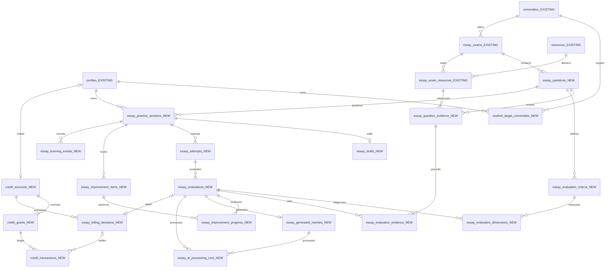
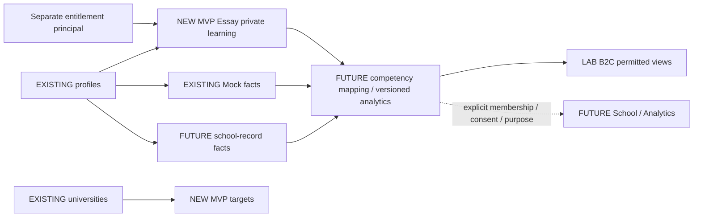

# Student Analytics-ready Data Architecture

Base design dated2026-09-28. **Base schema/RPC DEPLOYED** per
[accepted security verification](essay-lab-security-resolution.md); historical design sections below
retain their original stage. New2026-09-29 scaffolding extension is REVIEW ONLY / NOT APPLIED.
Implementation-level companion to the [existing longitudinal strategy](longitudinal-learning-admissions-data-strategy.md),
not a second strategy or student master. [Product specification](essay-lab-product-v1.md) governs
learner behavior. The [SQL review sources](../supabase/review/essay_lab_product/README.md) remain
separate from `supabase/migrations`; their promoted copies have since been applied.
Real student/AI/payment remain NOT_ENABLED; Flutter fixture preview exists.

## Scaffolding extension review — 2026-09-29

Keep19 and existing owner/history/FKs. Add only a proposed nullable structured observation envelope
on improvement_progress; store explicit core-focus selection and bounded sentence observations.
No extra sentence master/history/analytics table. Previous core IDs and comparison regime belong
in the existing evaluation input snapshot; absent observation never means resolved.
[Product policy](essay-lab-product-v1.md), [exact storage/RPC/runtime proposal](../supabase/review/essay_lab_product/scaffolding-review.md).
This is not implemented or a migration approval. Base security/identity acceptance is unchanged.

## Final history review — 2026-09-28

**Recommendation: KEEP19.** [Final review](essay-lab-final-schema-review.md) contains the full19-table
history/reconstruction/lifecycle/security/transaction matrix,12 query contracts and runtime gates.

LegendStudy는 학생의 현재 평가만 저장하지 않는다. 답안, 평가, 평가 항목, 보완점의 변화 등
학습 과정에서 발생한 핵심 historical facts를 보존하고, 성장·강점·반복 약점과 같은 분석 결과는
그 history에서 재계산하는 것을 기본 원칙으로 한다.
**History 보존은 모든 click/autosave를 영구 저장한다는 뜻이 아니다.**

Submitted snapshots, versioned evaluations/dimensions, issue observations, meaningful behavior,
provider runs and ledger movements have distinct retention boundaries. No current-only status
merge. Final SQL adds history guards, explicit predecessor, meaningful-stage dedupe and request/
posting uniqueness without adding tables. [Phase2A PostgreSQL17.11 runtime PASS](essay-lab-runtime-validation.md); shared-identity rollout,
actual server endpoints and Supabase JWT/PostgREST verification remain gates.

## Recommended MVP architecture — Owner decision summary

**Choose: existing profiles + four-layer architecture: canonical question/evidence/criteria,
private learning facts/results, separate commercial ledger, future derived analytics.**
19 new tables: 3 canonical + 12 private learning/operations + 4 commercial.
All columns in the SQL belong to the MVP proposal; nullable observations such as weight/model
version/cost are OPTIONAL capture within MVP, never fabricated. Tables explicitly marked FUTURE
are not present in SQL. Product features are separately scoped below. This is not 19
independent services: each table preserves an actual cardinality, mutable boundary or ownership
boundary. No academic profile extension, competency master, growth snapshot, payment product
catalog, institution/tenant or generic analytics framework in this draft.

| Decision | Choice / reason | Rejected alternative / expansion |
|---|---|---|
| Student | `profiles.id` shares auth identity, school/grade/academic status already present | Essay user master duplicates identity; academic-history domain later |
| Question | New `essay_questions` stable UUID + unique exam/question_key | Locator is a citation, not a selectable learning identity |
| Criteria | Versioned definitions tied to question and official evidence | Labels/JSON-only results cannot reliably join across attempts |
| Session | Repeated practice cycles per user/question, independent of price | Attempt-only grouping loses cycle entitlement and learning context |
| Draft/answer | One mutable draft; immutable submitted text per numbered attempt | Mutable submitted body destroys comparison; graph deferred |
| Evaluation | One request/result aggregate + provider-attempt telemetry | Separate request and result tables unnecessary in MVP; retries aren't re-evaluations |
| Improvement | Session issue identity + evaluation-specific observations | Overwriting one current status loses OPEN→IMPROVED→RESOLVED history |
| Evidence | Versioned question segment references existing mapping composite key | No PDF/body/resource duplication; source locator is versioned citation snapshot |
| Money | Account/grant/decision/append-only ledger | Balance integer alone loses origin, reservation, refund and expiry audit |
| Analytics | Derived queries from retained facts | Premature snapshots/comments not student truths |

## Current inventory — verified read-only, not inferred from migrations

2026-09-28 catalog query to `stlhijzpjfgwwdgunlsd` used `BEGIN READ ONLY` / `ROLLBACK`.
[Sanitized inventory](../supabase/review/essay_lab_product/current_schema_inventory.json) contains
24 public tables plus one existing view,23 function names, column/constraint metadata and profile RLS, no student rows or credentials.
Catalog names checked against every proposed table: no collision. Existing `exam_questions`
is the objective Mock/CSAT answer-key domain, not an Essay question identity.

| Existing tables | Classification / reuse |
|---|---|
| profiles | REUSE: PK `id → auth.users(id) ON DELETE CASCADE`; display_name, grade_level, NEIS office/school, target_date/label, academic_status, onboarding_completed_at. Existing owner RLS reused; no duplicate school/grade fields |
| universities | REUSE: platform master shared by Onboarding/MY/LAB/School/Analytics; university_id stays common |
| essay_exams | REUSE: UUID + unique university/year/exam_key; campus/track/field/session context; duration_minutes, question_count, answer_length_text, exam_format/date already exist |
| essay_exam_resources | REUSE: composite PK `(essay_exam_id,resource_id,role)`, source_locator, provenance, verification, official URL. No surrogate mapping UUID assumed |
| source_posts, content_items, resources | REUSE source chain/public delivery; source publication date stays separate from admission_year |
| bookmarks, recent_views | REUSE public content saving/reading; do not replace with Essay event duplicates |
| study_sessions, mock_exam_attempts, mock_exam_answers | REUSE shared auth/profile identity in future joins, retain original meaning/scale; do not copy into essays |
| day_targets | REUSE existing D-Day, not target universities |
| subjects, exams, exam_subjects, answer_key_versions, exam_questions, grade_cutoff_versions | Existing Materials/objective scoring, no Essay extension |
| admin_users, feedback_submissions, feedback_notifications, ingestion_quarantine, resource_resolver_quota | Existing operations, not commercial entitlements or student analytics |

No current target-university, payment/IAP, credit or generic analytics-event table exists in catalog.
Existing [entitlement reserve/settle design](architecture-in-app-exam.md#academic-record-entitlement-and-cost)
and [monetization roadmap](roadmap-monetization-and-in-app-learning.md) are reused. **EXTEND existing
tables: NONE**; extensions are new child tables. No `student_academic_profiles` now.

## Table decision matrix

All rows below except the explicitly future/optional row are **NEW MVP proposals**. SQL has
actual PK/FK/CHECK/UNIQUE/index/RLS; server protocols remain implementation requirements.
`O` = owner read, `D` = owner draft/target write, `S` = authenticated server writes only,
`P` = verified published public read, `X` = operator-only telemetry.

| Table | Why needed / why not JSON | Relation and expected query | Access / alternative considered |
|---|---|---|---|
| essay_questions | Stable selection/length/statistics identity | Exam 1:N; unique exam/question_key | P/S; locator-only rejected |
| essay_question_evidence | N:M question↔resource role/segment; exact version/source hash | Same-exam composite FKs; deterministic package | P/S; body copy rejected |
| essay_evaluation_criteria | Criterion identity + definition version + nullable weight | Question 1:N; source segment FK; compare dimensions | P/S; label identity rejected |
| student_target_universities | Cross-product FK interest, year, priority | Profile/university; unique including NULL year | O/D; profile JSON/string interests rejected |
| essay_practice_sessions | One cycle, many attempts, same question can recur later | Profile/question; owner recency | O/S; attempts-only rejected |
| essay_drafts | Mutable autosave with cross-device revision | Session 1:0..1; resume | O/D; mixed mutable/immutable attempts rejected |
| essay_attempts | Original text/version and writing facts | Session 1:N; unique attempt_no/submission key | O/S submission endpoint; answer UPDATE rejected |
| essay_evaluations | Logical request, terminal result, versions/hashes | Attempt 1:0..N; latest successful, processing queue | O/S; request/result split deferred |
| essay_evaluation_dimensions | Per-criterion integer level/explanation | Evaluation N criteria; same-question FK | O/S; whole-output JSON unqueryable |
| essay_improvement_items | Root issue ID independent of wording | Session + normalized issue_key unique | O/S; global perfect taxonomy deferred |
| essay_improvement_progress | Immutable evaluation observation/title/action/status | Issue×evaluation unique; same session enforced | O/S; overwrite status loses history |
| essay_evaluation_evidence | Explicit dimension/improvement/result citations | Same-question segment and same-evaluation child FK | O/S; citation array lacks referential integrity |
| essay_generated_rewrites | Optional private generation, once per evaluation | Evaluation 1:0..1; on-demand/reuse | O/S; official resource storage forbidden |
| essay_learning_events | Only otherwise lost actions with timestamp | Session + optional matching attempt/evaluation | O/S; no autosave spam/JSON payload |
| essay_ai_processing_runs | Each provider retry/cost/model lineage | Exactly one evaluation OR rewrite; one selected result | X/S; public result telemetry mixed storage rejected |
| credit_accounts | Separate principal and serialization lock | Profile nullable after erasure; balance query | O/S; profile balance rejected |
| credit_grants | Origin/expiry bucket and opaque reconciliation ID | Account 1:N; spend oldest eligible grant | O/S; no product/provider catalog now |
| essay_billing_decisions | Why charged/free, policy version and lineage | Logical evaluation 0..1; account + included-cycle reference | O/S; attempt-number billing rejected |
| credit_transactions | Append-only unit balance/reservation movements | Account/grant/decision; unique posting key | O/S append only; mutable balance rejected |
| academic profile/history; competency+mapping; institution membership; skill snapshots | FUTURE for actual domain/research need; OPTIONAL materialized caches | Same profile/university IDs; version/input scope/sample size | No tables created or permissions granted |

Question evidence is a **more specific/versioned citation**, not a second delivery mapping.
The source mapping locator can contain multiple students/sections; its composite PK cannot
represent each question slice separately. New evidence row's locator narrows it and captures
source SHA + mapping version. Before publication assembler verifies official/verified active
mapping, matching bytes/pages/question and non-temporary official URL. Multi-role and multi-PDF
sources stay supported. No whole official body in private evaluation rows.

Criterion definitions are verified structured transcriptions of official criteria; a derived
fallback must be labeled `legendstudy_derived`, use no official weight, and cite its real
question/intent source. Criterion source_evidence is one primary authority; additional supporting
segments remain in question/evaluation evidence. Official evidence source remains untouched.
Append a new criterion definition_version when meaning changes; don't update past definitions.

## ERD: [EXISTING] and [NEW MVP]

## Lifecycles, integrity and versions

**Session** identity/user/question is fixed, not a singleton per user/question. Targets are
mutable self-declared preferences; current status only interested/considering/planned. Applied/
accepted/rejected/withdrawn and multi-major application lifecycle are FUTURE privacy-reviewed
entities; don't pretend current interest row is a full admissions outcome history.

**Draft** mutable, one per session. Save sends expected revision and new revision=old+1;
conditional UPDATE with old revision prevents concurrent silent overwrite. DB trigger enforces
increment. New submission runs under session row lock, validates draft revision/hash/count,
allocates next attempt_no, inserts once by submission_key and clears/replaces draft atomically.
Client supplies text/context, server sets number/hash/submitted time; owner cannot POST fabricated
AI results. Revision count/order is linear in v1, no parent graph. Branching later can add parent FK.

**Answer storage:** MVP typed text in private DB; durable body SHA, server character count/count
convention, submitted time, mode/device. FUTURE private object storage for multi-image answers,
object manifest/hash and deletion ownership; no signed URL as identity and no imaginary v1 image
support in SQL. Hybrid is the extension recommendation, DB text is the actual current draft scope.
Character_count includes the declared official counting scheme; do not use byte length.
Question metadata_version and a **small conditions_snapshot** preserve actual applied min/max,
count rule and exam time/source-version at submission, not copied evidence prose. Official time
stays in essay_exams; question-specific duration nullable. No repetition of exam duration in every
question. Client active-writing_seconds nullable and bounded by wall duration, not a verified skill.

**Evaluation:** requested→processing→completed OR failed/cancelled. Timeout stays processing
until reconciled, not falsely failed. Completed/failed/cancelled rows are frozen; an actual fresh
reevaluation has new logical ID/idempotency key and version, while transport retries reuse the
old logical request. Request_hash mismatch on reused key returns conflict. AI provider retries
are run_no rows; late/losing runs can finish for audit but selected_result uniqueness chooses one.
One selected run records actual provider/model/version (nullable unknown), prompt version,
usage/cost basis/latency. User-private result also freezes chosen provider/model/version/prompt context so shorter operational
retention cannot erase judgment provenance. Result holds evaluation/contract/regime version, input/output
hashes and exact evidence membership; telemetry is not publicly readable. Output hash is audit,
not a promise of bit-identical stochastic reruns. No prompts/private bodies in normal logs.

Server completion transaction locks request, checks processing lease, selected completed run,
output schema, all expected criteria, same-question official evidence membership, citations,
unknown-level explanations and billing authorization; writes dimensions/issues/evidence then
sets completed/settles. Child insertion/update locks parent and rejects terminal parents; terminal
result update is blocked by SQL. No client writes to any results. Deletion exists only for explicit
erasure, not ordinary “edit.” RPC/finalization guards, lease recovery and publication validation
are **not implemented in this draft** and are required before migration promotion.

**Issues:** normalized issue_key assigned within session by versioned matcher/server, not label
string or AI's arbitrary cross-student taxonomy. E.g. one teacher-blame omission remains one issue
across multiple dimensions. Progress observation per issue/evaluation captures status + specific
explanation/action/priority. Missing observation means unknown, not resolved. Use comparable
selected evaluations to infer open→improved→resolved/recurred. Re-evaluation branches never
silently replace historical observations. Matcher uncertainty remains a review/uncertainty note;
no universal perfect identity claim. Current issue state is a query, not mutable truth column.

**Generated rewrite:** one logical row/evaluation, no regenerating successful result in v1.
Failed generation needs explicitly authorized retry semantics before offering a retry; don't insert
a second logical row. Source attempt follows evaluation FK. origin fixed ai_generated; versions/
hashes and selected run recorded. Viewing is a separate event, not one overwritten viewed_at.

## RLS and access matrix

| Actor | SELECT | INSERT | UPDATE | DELETE |
|---|---|---|---|---|
| Guest | Published canonical questions/evidence/criteria only | None | None | None |
| Authenticated other student | Same public data; no other student's rows | None on other's records | None | None |
| Owner student | Own session/answer/result/issues/rewrite/events/credits | Own target/draft only via direct RLS; submit/request via verified endpoint | Own target/draft only | Own target/draft only; learning erasure via endpoint |
| Processing server | Required question/evidence and requested private answer | Server-generated requests/results/events/ledger | Nonterminal request + result construction only | Explicit erasure handler only for learning; no ledger deletion grant |
| Admin/support | No inherited broad student access | No new client grant | Refund via audited server command in future | Retention workflow only |
| School/B2B | None in v1 | None | None | None |

Owner `user_id` is stored at session/target/account root, not copied into every child.
Invoker RLS joins parent chain; no security-definer owner helper. Composite FKs enforce same
question/session/evaluation for dimension, evidence, issue and event references. Slightly more
joins are accepted to avoid forged denormalized owner columns. Required parent/key indexes are
PK/UNIQUE or explicit. Billing reference user/account correspondence still requires server
transaction validation; composite grant/decision/account FKs prevent mixed-account postings.

Supabase service_role **bypasses RLS**; this is not least-privilege user authorization. Trusted
endpoints must authenticate owner, scope every query, expose no arbitrary table writes, select
minimal input, and keep credentials private. Draft grants deliberately give no authenticated
submission/evaluation/ledger write. A narrower database worker role/validated RPC is a promotion
gate; do not claim service_role restriction comes from RLS. Existing profile deletion has a direct
owner DELETE policy: before enabling private object storage, reconcile object erasure even when
profile deletion bypasses UI; no image objects are introduced by this text-only draft.

## Billing transaction contract — separate subsystem

Reuse CHECK→RESERVE→EXECUTE→SETTLE. `credit_accounts` is the serialization principal;
`credit_grants` stores origin/expiry, not a second balance. Ledger sums define balance and reserved
units; available=sum(balance_delta)-sum(reserved_delta). Account and grant balances must never
be negative after posting. Proposed CHECKs enforce movement shape, not cross-row balances.

Each grant receives purchase/promotion/admin_grant entry. Reserve: (0,+n). Consume: (-n,-n).
Release: (0,-n). Refund: (+n,0) referencing original consume. Expiration: (-n,0) only unreserved
remaining units. Signed adjustment is audited; refund total cannot exceed original consumption.
Spend by eligible grant expiry; reservation pins units; expiry must not steal reserved units.

Atomic application/RPC protocol (required before apply):
1. Lock account then session in consistent order; authorize owner, question/evidence readiness,
   policy version and request payload hash. Reuse exact idempotency key; mismatched payload fails.
2. Resolve paid cycle/included revision eligibility from successful decisions, not attempt_no.
   Failed requests do not exhaust benefit. Concurrent included revision claims serialize under
   session lock and pending decisions count as held benefits. Validate included_by is same session,
   account, successful eligible parent and no self/cycle. This preserves future policy flexibility.
3. For paid request, lock eligible grants in fixed order; ensure available units; write decision +
   unique reserve postings. For included revision, record credits_required=0 and reason/policy/
   parent decision; no fictitious consume row. Provider call starts only after commit.
4. Finalize valid output and selected run once; lock request/account; consume outstanding reserved
   units and mark settled in the **same transaction** as publishing completed result.
5. Definitive failure: release reservation exactly once and leave failed result. Timeout/late response
   requires reconciliation. Released/cancelled lease cannot publish a late success. Student retry
   creates a new authorization only after old work is reconciled; no double spend/refund.

Ledger posting idempotency key convention `decision UUID / grant UUID / reserve|consume|release`;
refund uses original consume + authorized refund-command UUID. Different arbitrary keys must
not bypass amount limits/state checks. Draft UNIQUE constraints alone are **not a working billing
engine**. No v1 SQL embeds attempt_no==2 or >=3 pricing. Example generation costs ops tokens but
has no new credit consume. Subscription/B2B membership extends account authorization and
policy reason; learning tables unchanged. Products/payment receipts integrations are deferred.

## Analytics, events and comparability

Recompute: distinct questions, attempts, evaluations, rewrites, direct rewrite ratio, first→second
completion, by university/year/field, writing-mode frequency, mean active time/count, length
compliance (snapshot scheme), recent frequency, issue persistence, target practice coverage.
No separate columns for each count. Draft actions are not completed attempts. Provider retries
are not user evaluation counts. Re-evaluation versions are not new student writing attempts.

Minimum factual lifecycle timestamps already exist: session created, attempt submitted, evaluation
requested/completed. Derive `essay_session_started`, `essay_attempt_submitted`,
`essay_evaluation_completed`, `essay_rewrite_submitted` events from them; don't duplicate writes.
Persist only `essay_rewrite_started`, `essay_example_rewrite_viewed`, `essay_official_source_opened`.
Server timestamp + dedupe event_key + same-session attempt/evaluation context; no freeform payload.
Example event means result was actually displayed, not merely button tapped/generated. Compare
first view to selected first/second completion/submission timestamps, retain the first actual view per meaningful stage, not repeated clicks.
Counts/ordering do not prove causal learning effects or absence of off-platform help.

Question-type classification (multi-label summary/comparison/analysis/application/evaluation)
and common competency mapping are **FUTURE reviewed derived metadata**, not official truth.
Practical mapping examples: Hanyang “공리주의 이해와 평가”→understanding/application/evaluation;
Sookmyung composition-change causal explanation→reasoning/application. This many-to-many
mapping is useful but not permission to average their levels. Each mapping needs version,
review status and provenance `legendstudy_derived`; keep official definition/weights untouched.
Initial dashboard compares within criterion/question/evaluation regime; no common 4.2 ability.

Regime comparison includes criterion definition, evaluation/contract/model/prompt version,
evidence completeness and writing conditions. Different question difficulty remains a limitation
even under identical model. FUTURE normalized comparisons require an independently validated
method; don't infer exact gain from 3→4. Derived caches/AI growth comments need analytics_version,
generated_at,input scope,sample_count,confidence; fact→analytics→comment stays three layers.
Snapshot tables only after measured query need. Preparation cache keyed by official source hash,
question, locator and assembler version; immutable rendered official segments reusable across
students. Private answer cache is separate/access-controlled. No vector/RAG dependency.

## Delete, retention and privacy

Text learning cascade: profile→session→draft/attempt→evaluation→dimension/evidence/progress/
rewrite/telemetry; issue and event session children also cascade. Targets cascade. Canonical
university/exam/resources restricted; deleting a student never deletes official materials.
Single answer removal erases its evaluations/examples and linked events; clean any now-empty
issue identity, don't relabel other attempts. Empty session may remain or be deleted by request.

Financial account user_id SET NULL and decision evaluation_id SET NULL; ledger references
account/grant/decision retained without answer text or profile PII. Retention duration is separately
reviewed, not infinite by default. No blanket deleted_at. Erasure endpoint first fences active jobs,
reconciles/release billing, then deletes; late worker cannot recreate deleted facts. Provider retention
and backups need documented deletion SLA. FUTURE image manifests add durable purge/outbox
before row deletion and retries/storage sweeper; pure FK cascade cannot delete external objects.
Current text-only draft supports relational erasure, not an already implemented full deletion service.

## Indexes and workload

Explicit: sessions(user,created_at,id), evaluations(attempt,requested_at), pending requests partial,
progress(evaluation), events(session,time), selected provider-run uniqueness and start time,
ledger(account,time,id)/grant, pending decisions. Natural unique keys cover session attempts,
criterion lookup and evidence scope. No speculative JSON GIN/full-text/index on answer body.
Dimension/event/processing rows scale with evaluations×criteria/retries/actions; do not invent user
volume. Profile target and private-root checks use FK/PK indexes; measure joins before denormalizing.

## 15 use-case walkthroughs

“SUPPORTED” means represented by draft + stated transactional contract, **not runtime verified**.

| Case | Result | Concrete path / limit |
|---|---|---|
| 1 first answer/paid assessment | SUPPORTED | session→attempt1→evaluation→decision paid_cycle→reserve/consume; dimensions/citations |
| 2 first revision/free assessment/change | SUPPORTED | same session attempt2, included_revision parent decision, progress + comparable level delta; policy separate |
| 3 example view/no charge | SUPPORTED | unique evaluation rewrite + actual-display event; no new billing decision/consume |
| 4 third revision/new credit | SUPPORTED | new attempt/evaluation, current policy paid decision; SQL has no attempt pricing |
| 5 v2 reevaluates attempt1 | SUPPORTED | same attempt new evaluation + regime/version and selected provider run; old result immutable |
| 6 Hanyang/SKKU targets/history | SUPPORTED | targets.profile/university FK joins sessions.question→exam.university; no text matching |
| 7 issue OPEN→IMPROVED→RESOLVED | SUPPORTED | same issue_key/ID, three evaluation observations; history preserved |
| 8 AI failure/retry/no duplicate charge | SUPPORTED | request/submission/posting unique keys + account/session locks, release/reconcile protocol; RPC/runtime tests still required |
| 9 first-vs-second-result example viewing | SUPPORTED | timestamp + evaluation/attempt/session event vs result/submission times, repeated views retained |
| 10 erase learning/financial separation | PARTIAL | text cascades and nullable billing link specified; job fencing/provider/backups/financial retention implementation and FUTURE object purge not provided |
| 11 PC→Mobile draft continuity | SUPPORTED | one session draft, revision CAS; UI conflict/recovery implementation later |
| 12 weighted vs qualitative criteria | SUPPORTED | official_weight_percent nullable; dimension level independent; no invented percentage |
| 13 official and common competency | PARTIAL | official identity ready; versioned many-to-many competency mapping deliberately FUTURE, not a present FK/table |
| 14 v1.2 and v2 coexist | SUPPORTED | evaluation versions/hashes, each provider run model/version; regime comparison excludes mismatched versions |
| 15 future School entitlement | PARTIAL | private schema unchanged; account principal/membership/policy extension required and no B2B access granted today |

## Answers to the 20 design questions

| Q | Recommendation |
|---|---|
| Q1 profiles | Yes; auth-backed current profile is the common student identity |
| Q2 academic profiles | Defer; existing grade/school/status suffice, history with grade/Mock domain later |
| Q3 target universities | MVP, shared with onboarding/MY; optional user input, no compulsory admissions outcomes |
| Q4 questions | Yes, stable selection/answer/length/evidence/statistics identity; not locator strings |
| Q5 criteria | Yes, question-scoped append-version definitions with source FK and nullable official weight |
| Q6 sessions | Yes, learning and entitlement cycle across multiple attempts |
| Q7 drafts | Separate one mutable draft/session; immutable attempts through server submit |
| Q8 body | Private DB text now; hybrid private image storage later, no public resources reuse for student images |
| Q9 results | Columns/relations for identity/status/versions/dimensions/issues/citations; text/arrays for prose/strengths/checklist; bounded conditions JSON only |
| Q10 lifecycle | Session issue ID + one observation per issue/evaluation, derive current state |
| Q11 change | Compute comparable dimension deltas and issue changes; future narrative snapshot separately versioned |
| Q12 examples | On-demand private DB text, unique evaluation; no v1 successful regeneration |
| Q13 stars | Nullable integer essay_evaluation_dimensions.level_1_to_5, explanation required; NULL has uncertainty reason |
| Q14 weight | Nullable official_weight_percent on criterion definition; not product stars or official predicted score |
| Q15 versions | Evaluation/contract/regime and manifest/input/output hashes; selected processing run plus frozen evaluation provider/model/prompt snapshot for independent retention |
| Q16 credit set | credit_accounts + credit_grants + essay_billing_decisions + credit_transactions; no standalone mutable balance |
| Q17 included revision | Reason included_revision, credits_required=0, policy_version, parent cycle decision; server policy/locking |
| Q18 retry | Request payload hash/idempotency + serialized reservations + unique postings + atomic publish/settle + reconcile timeouts |
| Q19 viewing | Actual display event referencing session/attempt/evaluation with server timestamp |
| Q20 ecosystem | Shared profile/university IDs; private learning unaffected by future domain tables, tenant authorization explicitly separate |

## Review decisions and outstanding gates

Product spec READY; architecture READY; SQL/credit/privacy **READY_FOR_OWNER_REVIEW**, not applied.
Production migration readiness **NO**. UI implementation **CONDITIONAL** on Owner contract approval;
write integration additionally waits for RPC + runtime RLS/security verification. Rewrite feature
still CONDITIONAL; stars are proposed product outputs, not already benchmarked calibration.

Owner review: overall-sentence/no-overall-star recommendation; text-first MVP; 19-table boundary;
partial Cases10/13/15; commercial expiration/refund/cancellation policy; provider/minor/privacy/rights
review. Next implementation must supply publishing/finalization/billing/erasure transactions,
request lease recovery and local multi-user concurrency tests. This phase's checks are static.
